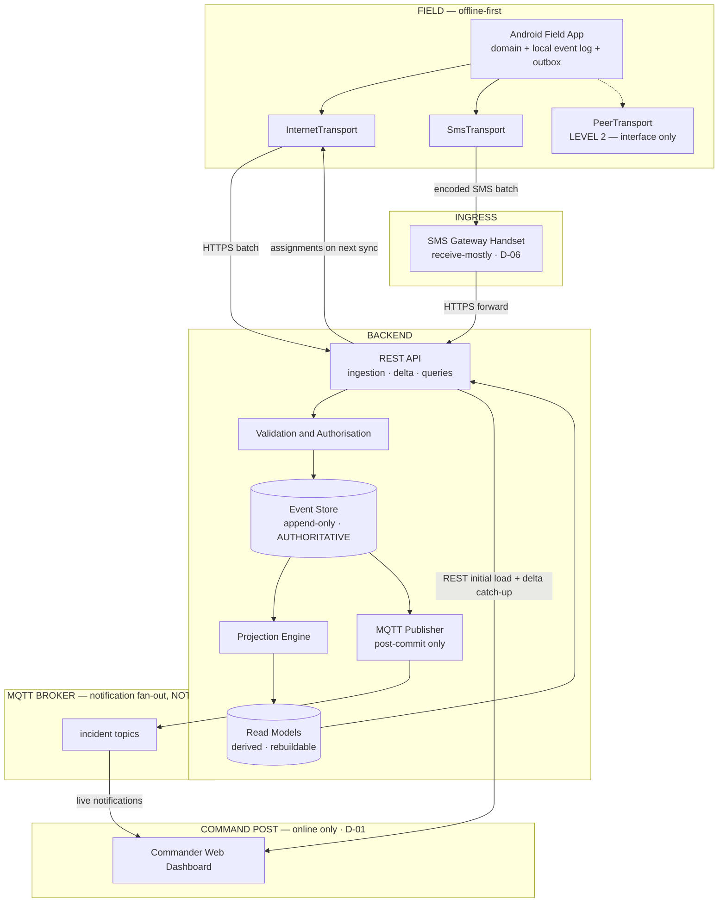
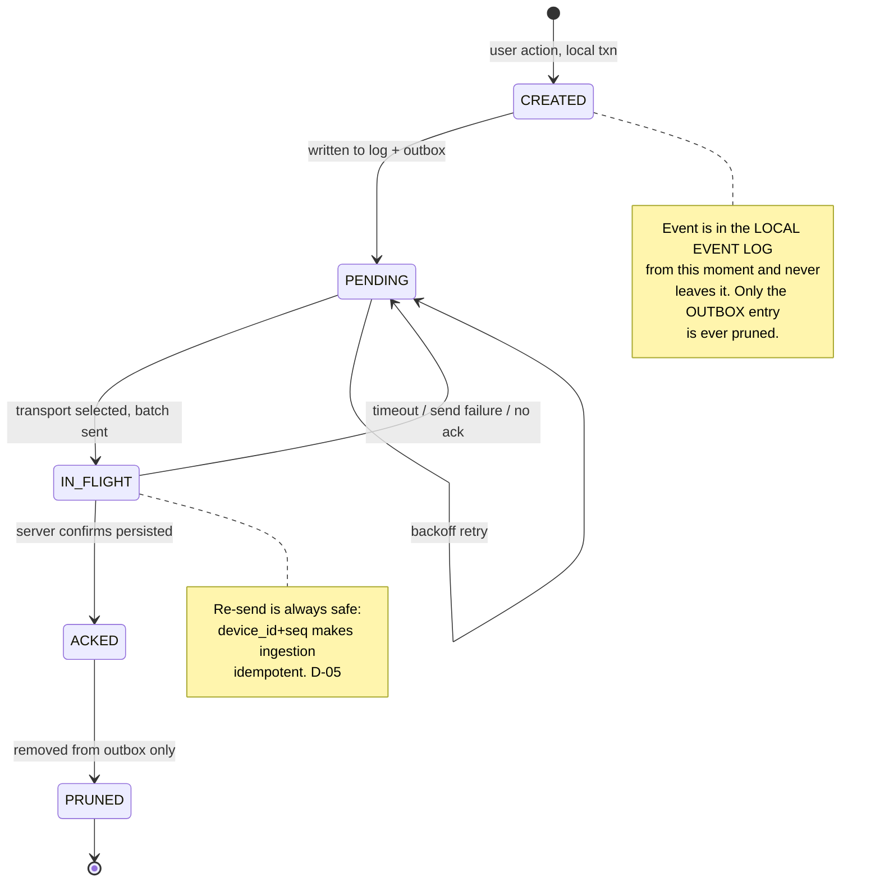
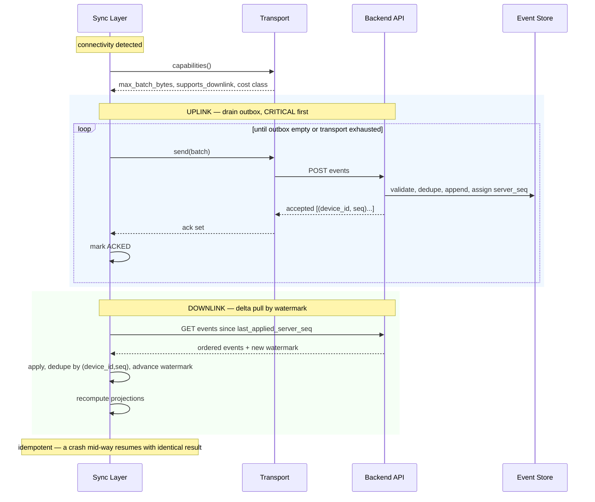
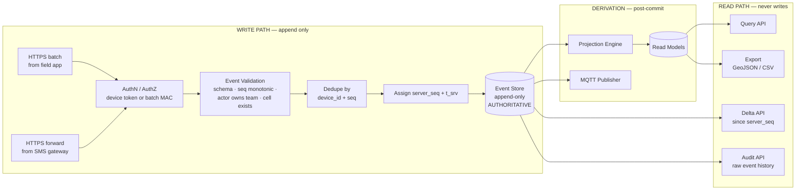
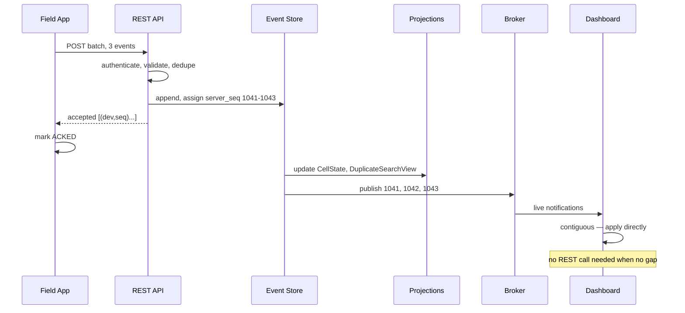

# RescueNet AI — System Architecture (v1.0)

**Date:** 2026-08-22 · **Stage:** Architecture · **Target:** Minimum Demonstrable Spine (D-03)
**Source of truth:** the official problem statement, then [`01`](01-requirements-analysis.md) · [`02`](02-prototype-scope.md) · [`03`](03-feasibility-analysis.md) · [`04`](04-feasibility-validation.md) · [`05`](05-final-decisions.md)

> **Technology-neutral by instruction.** No framework, database, broker, library or hosting choice is made here. Every component is specified by its contract and obligations so the stack can be selected separately afterwards.

> **No code, no folders, no dependencies, no UI.** This document is design only.

---

## 0. Standing evidence wording

Wherever this architecture rests on hardware evidence, it must be described exactly as follows:

- The hardware test established that **the generated GSM-7 payloads were transmitted unaltered between the two tested handset/SIM routes, in both directions**.
- **Payloads up to 459 characters arrived intact and passed exact verification.** Exact SMS segment counts were **not** observed.
- **Carrier identities were not recorded.**
- **Programmatic Android SMS is validated for the text path** (SP-01b-A, 2026-08-24: A→B 10/10, one segment, median 1.6 s; B→A 8/10). **Binary/port-addressed SMS FAILS** (0/10, `GENERIC_FAILURE`) and is not used. The RescueNet application itself does not send SMS until M8 ships.

No section below may state more than this.

---

## 1. Architectural principles

| # | Principle | Traces to |
|---|---|---|
| P-1 | **The event log is the source of truth.** All operational facts are immutable appended events. Every other representation is a derived projection. | FR-1001, FR-1002, PS-B7, `05` "Event-log-based synchronization is mandatory" |
| P-2 | **The local write always succeeds.** No user action on the critical path waits on a network, a server, or a broker. | FR-402, PS-K4, EC-01 |
| P-3 | **Transports are interchangeable and opaque.** The sync layer moves byte batches; it never knows which medium carries them. | `05` "Synchronization must be transport-agnostic", `03` §2.6 |
| P-4 | **Nothing that was accepted is ever discarded.** Additive events are union-merged; contradictions are surfaced, not resolved by deletion. | FR-806, D-01b, PS-B4 |
| P-5 | **Freshness is part of the data.** Every value shown to a commander carries its age and provenance. | FR-705, FR-410, EC-02 |
| P-6 | **Bandwidth is spent on life-critical data first.** | D-04, FR-808, NFR-01 |
| P-7 | **Derived state is rebuildable.** Any projection can be reconstructed from the log alone — this is simultaneously the audit story and the recovery story. | FR-1001, NFR-19 |
| P-8 | **Level-2 extension points must cost Level-1 nothing.** An unimplemented extension point is an interface, never a branch in Level-1 code. | `02` §1.3 rule 3 |

---

## 2. System overview



**Reading the diagram:** every arrow into `LOG` is a durable write; every arrow out of `RM` is a derived read. The broker sits on a branch that can be severed without loss of correctness — that is the point of §9.

---

## 3. Layering and dependency rules

Dependencies point **strictly downward**. A layer may know the layer beneath it and never the one above.

```
┌─────────────────────────────────────────────────────┐
│ PRESENTATION      field app screens · dashboard UI  │
├─────────────────────────────────────────────────────┤
│ APPLICATION       use cases: mark searched, report  │
├─────────────────────────────────────────────────────┤
│ DOMAIN            events · grid · merge rules ·     │  ← no transport, no SMS,
│                   duplicate detection · projections │     no MQTT, no HTTP
├─────────────────────────────────────────────────────┤
│ SYNC              outbox · sequencing · batching ·  │  ← knows Transport interface
│                   priority · retry · ack · watermark│     only, never an impl
├─────────────────────────────────────────────────────┤
│ TRANSPORT (abstract interface)                      │
├─────────────────────────────────────────────────────┤
│ TRANSPORT IMPLS   Internet · Sms · [Peer — L2]      │
├─────────────────────────────────────────────────────┤
│ CODEC             compact encoding · framing ·      │  ← ALL payload-size and
│                   segmentation · reassembly         │     segmentation logic
└─────────────────────────────────────────────────────┘
```

**Enforced rules** *(verified in §17)*
1. `DOMAIN` has no reference to any transport, protocol, broker or wire format. It deals in events and projections only.
2. `SYNC` references the transport **interface** only. It never names SMS, HTTP or MQTT.
3. All SMS-specific behaviour — payload limits, framing, segmentation, reassembly — lives in `CODEC` and `SmsTransport`. **AD-07.**
4. MQTT is not a layer. It is an optional delivery accelerator attached to the backend's post-commit path and the dashboard's read path. It appears nowhere in the field app at Level 1.
5. No layer calls upward. Notification of inbound data is delivered by the sync layer raising domain events, not by transports calling into the domain.

---

## 4. Event model, identity and ordering

### 4.1 The event

Every operational fact is an immutable event. Fields split into three groups:

| Group | Fields | Assigned by | Purpose |
|---|---|---|---|
| **Identity** | `device_id`, `seq` | Device, at creation | Primary key. **D-05.** Deterministic, no coordination needed |
| **Attribution** | `responder_id`, `team_id`, `agency_id`, `t_dev` | Device | FR-1002, FR-107, PS-B7 |
| **Server** | `server_seq`, `t_srv` | Backend, at commit | Global ordering and delta watermarking |

Event kinds at Level 1: `CELL_STATUS` · `SURVIVOR_REPORT` · `POSITION` · `INVENTORY_DELTA` · `ASSIGNMENT` *(server-authored)* · `ENROLMENT` *(server-authored)*.

### 4.2 Identity — `(device_id, seq)` · D-05

- `device_id` is issued once at enrolment and is stable for the device's life.
- `seq` is a **strictly monotonic per-device counter**, allocated from a persisted counter **inside the same local transaction that writes the event**. If the transaction rolls back, the seq is consumed and left as a gap. Gaps are legal; reuse is not.
- Consequence: identity is assignable **completely offline, with no coordination**, and is idempotent by construction — re-delivery of the same `(device_id, seq)` is a no-op at every node. Validated in `04` §3.2.
- UUIDs are prohibited on the wire: 16 B/event against a ~134 B budget (`04` §3.1). **AD-05.**

### 4.3 Ordering and clock skew

| Concern | Level-1 decision | Traces to |
|---|---|---|
| Global order | `server_seq` — a monotonic counter assigned at commit. The single ordering authority | FR-812 substitute |
| Display time | `t_srv` (server receipt) | `03` §3.8 |
| Audit time | `t_dev` retained verbatim, never corrected, never used for ordering | FR-1002, NFR-19 |
| Skew correction | **Level 2.** Device may record its observed offset at each successful sync for later analysis | FR-812 |

**Accepted limitation (AL-05):** two events created offline in a known order may receive `server_seq` in the opposite order if they sync by different paths. The audit view shows both `t_dev` and receipt order so a human can see it. Not corrected at Level 1.

### 4.4 Event lifecycle



**Critical distinction:** `PRUNED` removes the *outbox* entry, never the *event*. The local event log is append-only and retained for the incident. **AD-11.**

---

## 5. Offline architecture

### 5.1 Local storage

Three logical stores on the device (one physical embedded database, chosen later):

| Store | Contents | Mutability |
|---|---|---|
| **Local event log** | Every event the device authored **and** every event it has received | Append-only |
| **Outbox** | One row per authored, not-yet-acknowledged event: state, priority, attempt count, next-attempt time | Mutable |
| **Projections** | Locally computed cell state, my assignment, inventory totals, survivor list | Derived, rebuildable |

**Durability requirement:** the event write, the seq allocation and the outbox insert occur in **one transaction**. Either all three commit or none do. This is what makes NFR-07 achievable and is the subject of spike SP-04. **AD-10.**

### 5.2 Offline data flow

```mermaid
sequenceDiagram
    participant U as Responder
    participant UI as Field App UI
    participant D as Domain
    participant L as Local Event Log
    participant O as Outbox
    participant S as Sync Layer

    U->>UI: mark B-14 searched (tap 3 of 3)
    UI->>D: MarkCellSearched(B-14)
    D->>D: validate against local state
    D->>L: append CELL_STATUS, allocate seq
    D->>O: insert outbox row, PENDING, ROUTINE
    Note over L,O: single transaction — both or neither
    D-->>UI: committed
    UI-->>U: confirmed, no spinner, no network
    D->>D: recompute local projections
    UI-->>U: B-14 shows searched, "3 queued, not synced"

    loop while no transport available
        S->>S: nothing to do; outbox retained
    end
```

**No network call exists on this path.** P-2, FR-402.

### 5.3 Outbox mechanics

| Concern | Decision |
|---|---|
| **States** | `PENDING → IN_FLIGHT → ACKED`; `IN_FLIGHT → PENDING` on failure; `IN_FLIGHT → REJECTED` on a permanent server verdict. **See the note below on `PRUNED`** |
| **Priority (D-04)** | Two tiers only. `CRITICAL` = `SURVIVOR_REPORT` (and `SOS` at L2). `ROUTINE` = everything else. Drain and pack CRITICAL first, always |
| **Batching** | Sync layer asks the transport for `max_batch_bytes`, then asks the codec to pack the highest-priority pending events that fit |
| **Retry** | Exponential backoff with jitter, per transport, capped. Attempt count and next-attempt time persisted so backoff survives restart |
| **Acknowledgement** | Server returns the set of accepted `(device_id, seq)`. Only those are marked ACKED. Unmentioned events stay PENDING |
| **Failure** | Never drops an event. An event that cannot be sent stays PENDING indefinitely |
| **Pruning** | Only ACKED outbox rows are pruned, and only when local storage pressure requires it. FR-811 |

**Terminology note — `PRUNED` is not a state (added 2026-08-23).** An earlier revision of the
row above wrote the lifecycle as `PENDING → IN_FLIGHT → ACKED → PRUNED`, which reads as though
`PRUNED` were a fourth persisted value. It is not. **Pruning is row deletion** under the
retention policy of `08` §6.3 — a pruned row does not exist, so it holds no state.

| | |
|---|---|
| **Persisted outbox states** | `PENDING` · `IN_FLIGHT` · `ACKED` · `REJECTED` |
| **`PRUNED`** | Not a state. Row deletion under retention pressure |
| **What may be pruned** | `ACKED` rows first, then received (non-authored) events, which a delta pull can recover |
| **What is never pruned** | `PENDING` rows, locally authored events, and **`REJECTED` rows** — the rejection reason must survive for diagnosis (**DM-40**) |
| **Authority** | **`08` §6.2 and AP-14 are authoritative for the current outbox model.** This section is a summary of them |

`REJECTED` postdates this section: it was added on approval of **AP-14** (2026-08-22, `09`
§0) as a terminal **delivery** state describing the outbox row, never the event. The domain
event remains permanently in the local log and is never deleted because it was rejected
(**DM-39**, **DM-40**).

### 5.4 Reconnection — deterministic by construction

Two independent monotonic watermarks drive reconnection, so the outcome does not depend on timing:

- **Uplink watermark:** the outbox itself — everything not ACKED is owed to the server.
- **Downlink watermark:** `last_applied_server_seq` — everything after it is owed to the device.



**Why this is deterministic:** both directions are driven by persisted monotonic markers, and both are idempotent. Interrupting and repeating any step produces the same final state. **AD-12.**

---

## 6. Merge, projections and duplicate detection

### 6.1 Why no CRDTs

CRDTs solve concurrent **in-place mutation** of shared state. This architecture has none:

1. Every write is an **immutable append** with a globally unique key. Two devices can never write the same cell.
2. Every piece of mutable-looking state — cell status, inventory quantity, assignment owner — is a **deterministic fold over the event log**, not a stored mutable value.
3. Therefore merging is **set union on primary keys**, which is already commutative, associative and idempotent.

Validated: `04` §3.2, 13/13 including partition, reunion, duplicate delivery, out-of-order arrival and a node that never met the server. **CRDTs remain Level 3 and are not needed.** **AD-14.**

### 6.2 Projections

| Projection | Rule | Serves |
|---|---|---|
| `CellState` | Latest `CELL_STATUS` per cell by `server_seq` | FR-302, FR-304 |
| `CellHistory` | All status events for a cell, ordered, with full attribution | PS-B7, FR-305 |
| `DuplicateSearchView` | Cells with `CELL_STATUS(searched)` from **≥2 distinct teams** | **D-01b**, PS-B4 |
| `TeamPosition` | Latest `POSITION` per team, **with age** | FR-405, FR-705 |
| `Inventory` | Sum of `INVENTORY_DELTA` per item per team | FR-603 |
| `SurvivorList` | Union of all `SURVIVOR_REPORT` — never deduplicated at L1 | FR-501, AL-11 |
| `CoverageMetrics` | Counts over `CellState` | FR-703 |

Every projection is a pure function of the log — rebuildable at any time, which is both the audit mechanism (P-7) and the recovery mechanism.

### 6.3 Duplicate search effort — D-01b

The scenario is not special-cased. It falls out of P-4:

1. Both `CELL_STATUS` events have distinct `(device_id, seq)` keys → union keeps both. Neither can overwrite the other; **there is no code path that would**.
2. `CellState` folds to one displayed status (deterministic by `server_seq`).
3. `CellHistory` retains both, fully attributed.
4. `DuplicateSearchView` observes ≥2 distinct teams on one cell and raises the flag.

**No silent discard is structurally possible**, because the store is append-only and keyed by an identity no other device can produce. Verified in `04` §3.2.

---

## 7. Transport abstraction

### 7.1 The interface

```
capabilities() → TransportCapabilities
    max_batch_bytes        int
    supports_downlink      bool
    latency_class          FAST | SLOW | VERY_SLOW
    cost_class             FREE | METERED
    ordering_guaranteed    bool
    available              bool

send(batch: OpaqueBytes, priority: CRITICAL|ROUTINE) → SendTicket

receive() → [InboundBatch]        // opaque bytes inbound, may be empty

acknowledge(ticket | inbound_ids) // confirm handled; enables cleanup
```

**Contract obligations**
- `batch` is **opaque bytes**. The transport never inspects, parses or reorders it. **AD-06.**
- The sync layer chooses transports **only by declared capabilities**, never by name or type. **AD-07.**
- `max_batch_bytes` is a generic capability, not an SMS concept: `InternetTransport` declares a large value, `SmsTransport` a small one.
- No transport may block a domain operation. All calls are asynchronous relative to the UI.

### 7.2 Implementations

| Implementation | Level | Uplink | Downlink | Notes |
|---|---|---|---|---|
| `InternetTransport` | **1** | HTTPS batch POST | HTTPS delta pull | Primary path when data exists |
| `SmsTransport` | **1** | Encoded SMS batch → gateway | Minimal ack only — **D-06 receive-mostly** | Fallback when data is unavailable. **D-02** |
| `PeerTransport` | **2** | — | — | **Interface-only extension point.** No Level-1 code branches on it, no Level-1 behaviour changes if it never exists. P-8 |

### 7.3 Transport selection

The sync layer applies a fixed rule over `capabilities()`:

1. Prefer `available && cost_class == FREE && latency_class == FAST` → Internet.
2. Otherwise the highest-capability available transport, subject to priority: **`ROUTINE` events are not sent over a `METERED`, `VERY_SLOW` transport**; only `CRITICAL` events use the SMS path when internet is absent. This is D-04 doing real work — it prevents position telemetry from consuming SMS capacity.
3. If nothing is available, remain PENDING.

**Level-2 safety:** adding `PeerTransport` means registering one more implementation. Rule (1) and (2) are unchanged. **AD-08.**

---

## 8. SMS codec layer

**All SMS-specific knowledge lives here and nowhere else.** §3 rule 3.

| Concern | Design |
|---|---|
| **Encoding** | **GSM-7 text (D-02a FINAL)**, bit-packed fields. **All widths ratified in `09` §6.6 (DM-57)**: **12 B** batch header (89 b) and 35–92 b per batched event across the four SMS-eligible types. The "8–13 B per event, 7 B header" figures from `04` §3.1 are **superseded** — they predate DM-38 and DM-01 |
| **Alphabet** | GSM-7-safe base64url. **Hardware evidence:** the generated GSM-7 payloads were transmitted unaltered between the two tested handset/SIM routes in both directions; payloads up to 459 characters arrived intact and passed exact verification |
| **Framing** | `(batch_id, part_index, part_total, device_id, mac)` so multi-part batches reassemble deterministically |
| **Segmentation** | Codec packs to the transport's `max_batch_bytes`. **Exact SMS segment counts were not observed** (`04` §4.0.1), so segment economy is treated as unvalidated — TL-10 |
| **Reassembly** | Gateway buffers parts by `batch_id`; incomplete batches expire and the device retries the whole batch |
| **Integrity** | Truncated MAC over the batch using a per-device secret established at enrolment over HTTPS. See §14 for its honest limits |
| **Downlink** | One compact ack per batch carrying the highest contiguous accepted `seq`. **D-06** keeps the gateway receive-mostly |

```mermaid
sequenceDiagram
    participant S as Sync Layer
    participant C as Codec
    participant ST as SmsTransport
    participant GW as Gateway Handset
    participant API as Backend API

    S->>ST: capabilities()
    ST-->>S: max_batch_bytes, VERY_SLOW, METERED
    S->>S: select CRITICAL events that fit
    S->>C: encode(events)
    C-->>S: opaque bytes + framing
    S->>ST: send(batch, CRITICAL)
    ST->>GW: SMS message(s)
    Note over ST,GW: text SMS validated SP-01b-A 2026-08-24; binary rejected
    GW->>GW: reassemble by batch_id
    GW->>API: HTTPS forward, decoded batch
    API->>API: verify MAC, dedupe by (device_id,seq), append
    API-->>GW: accepted set
    GW->>ST: compact ack, highest contiguous seq
    ST-->>S: ack
    S->>S: mark ACKED
```

**Honest status:** the codec design rests on measured payload arithmetic (`04` §3.1) and on payload-integrity evidence. **The RescueNet application does not currently send SMS; programmatic Android SMS behaviour remains unvalidated.**

---

## 9. MQTT — precise contract

MQTT is included because real-time dashboard updates need it. It is **deliberately confined** so that removing the broker degrades latency and nothing else.

### 9.1 The eleven required definitions

| Question | Answer |
|---|---|
| **What MQTT is used for** | **Post-commit notification fan-out to the commander dashboard.** Nothing else at Level 1 |
| **What REST/API is used for** | **All durable writes and all authoritative reads:** enrolment, event ingestion, delta pull, read-model queries, export |
| **Which system is authoritative for persisted state** | **The backend event store. Always. MQTT is never authoritative** |
| **What happens if an MQTT message is missed** | Every MQTT message carries `server_seq`. A subscriber that sees `server_seq > last_applied + 1` knows it missed events and issues a **REST delta pull**. Loss costs latency, never correctness |
| **How a mobile client catches up after reconnecting** | **Field clients do not use MQTT at Level 1.** They catch up by the §5.4 sequence: drain outbox, then REST delta pull from `last_applied_server_seq` |
| **How MQTT and event-log sync interact** | MQTT publishes *after* the event is committed to the log. It is a downstream projection of the log, one-directional, and cannot influence it |
| **Which events are published** | Committed events plus derived flags the dashboard needs live: new/changed `CellState`, `SURVIVOR_REPORT`, `TeamPosition`, and **`DuplicateSearchFlag`** |
| **Which operations require REST** | Enrolment · event ingestion · delta pull · initial dashboard load · all queries · assignment creation · export. **Every write, without exception** |
| **Commands, notifications, sync events, or a combination?** | **Notifications only.** MQTT never carries commands and never carries authoritative sync state. A message is a hint that says "this happened, at this `server_seq`" |
| **Not the only source of truth** | Guaranteed structurally: the broker has no write path to the store, and every subscriber can reconstruct full state from REST alone |
| **QoS posture** | Correctness does not depend on QoS, because the gap check is the backstop. Higher QoS reduces avoidable REST pulls; it does not change outcomes |

### 9.2 MQTT flow and gap recovery

```mermaid
sequenceDiagram
    participant L as Event Store
    participant P as MQTT Publisher
    participant B as Broker
    participant D as Dashboard
    participant API as REST API

    Note over D,API: 1. INITIAL LOAD — REST is authoritative
    D->>API: GET snapshot
    API-->>D: read models + current server_seq = 1000
    D->>D: last_applied = 1000
    D->>B: subscribe incident topics

    Note over L,D: 2. LIVE — MQTT accelerates
    L->>P: committed event, server_seq 1001
    P->>B: publish
    B->>D: event, server_seq 1001
    D->>D: 1001 == 1000+1, apply, last_applied = 1001

    Note over B,D: 3. LOSS — broker drop, disconnect, or network blip
    L->>P: server_seq 1002
    P->>B: publish
    B--xD: NOT DELIVERED
    L->>P: server_seq 1003
    P->>B: publish
    B->>D: event, server_seq 1003

    Note over D,API: 4. GAP DETECTED — REST repairs it
    D->>D: 1003 > 1001+1 — gap
    D->>API: GET events since 1001
    API-->>D: 1002, 1003, new watermark
    D->>D: apply in order, last_applied = 1003
    Note over D: correctness restored; only latency was lost
```

**AD-16, AD-17.** This single mechanism answers "what if a message is missed", "how does the dashboard recover", and "MQTT is not the source of truth" simultaneously.

### 9.3 Explicitly excluded at Level 1
Field-app MQTT subscription *(Level 2 — costs a persistent connection and battery for no offline-first benefit)* · MQTT as an ingestion path *(a broker ack would not mean "persisted", breaking the acknowledgement contract — **AD-15**)* · retained messages as state *(retained messages are a cache, never truth)* · commands over MQTT.

---

## 10. Backend architecture

### 10.1 Write path and read path



**The separation is absolute:** the read path never writes, and the write path never consults a read model to make a decision. **AD-18.**

### 10.2 Components

| Component | Obligations |
|---|---|
| **REST API** | The only durable-write entry point. Enrolment, ingestion, delta, queries, export, audit |
| **AuthN/AuthZ** | Device token (HTTPS) or batch MAC (SMS). Read-all within incident; write only own team's events. FR-106, FR-908 |
| **Validation** | Schema · `seq` monotonic per device · actor belongs to claimed team · cell exists in this incident's grid · event kind permitted for role |
| **Dedupe** | Primary key `(device_id, seq)`. A repeat is accepted and reported as accepted — idempotent, so retries over any path are safe |
| **Event Store** | Append-only, authoritative, assigns `server_seq` and `t_srv`. Never updated, never deleted |
| **Projection Engine** | Rebuilds read models from the log. Must be able to rebuild from empty |
| **MQTT Publisher** | Post-commit only. Publishes committed events with their `server_seq` |
| **SMS Gateway Receiver** | Reassembles parts, verifies MAC, forwards decoded batches to ingestion. Holds **no** domain logic |
| **Audit Subsystem** | The event log itself, plus a query API returning full attribution and both timestamps. FR-1001, FR-1002, NFR-19 |
| **Read Models** | Derived, disposable, rebuildable. Never a source of truth |

### 10.3 Online data flow



---

## 11. Commander dashboard — online only (D-01)

| Concern | Design |
|---|---|
| **Initial load** | REST snapshot: read models + `current_server_seq`. Authoritative, always sufficient on its own |
| **Live updates** | MQTT subscription per incident topic |
| **Reconnect / catch-up** | §9.2 gap check → REST delta since `last_applied_server_seq`. On a long disconnect, fall back to a fresh snapshot |
| **Stale indication** | Two signals: per-team `t_srv` age from `TeamPosition` (FR-705), and a global banner if the MQTT connection is down showing "live updates offline, last refreshed HH:MM" |
| **Duplicate visualisation** | Cells in `DuplicateSearchView` render with a distinct marker **plus** a non-colour cue; clicking shows `CellHistory` — every team, agency, responder and both timestamps. **D-01b** |
| **Grid state** | Cells coloured by `CellState` with colour **plus** pattern, never colour alone. Unsearched cells are visually and numerically distinguishable at all times. FR-304 |

**D-01 compliance:** the dashboard requires connectivity. There is no local store, no offline cache and no edge server. If the backend is unreachable the dashboard displays its last snapshot **clearly marked stale** and does not accept assignments.

---

## 12. Low-bandwidth design

| Mechanism | Decision | Traces to |
|---|---|---|
| **Batching** | Pack the highest-priority pending events into one `max_batch_bytes` payload. Measured: 19 events ≈ 168 B | NFR-01, `04` §3.1 |
| **Compact encoding** | Bit-packed fields; `(device_id, seq)` = 4 B; origin-relative 16-bit coordinates = 4 B | AD-05, `04` §3.1 |
| **Priority** | Two tiers, D-04. CRITICAL never queues behind ROUTINE | FR-808 |
| **Delta sync** | Downlink is always "since `server_seq`". Full state is never transmitted after initial load | FR-802 |
| **Compression** | **Deliberately NOT used at Level 1.** Bit-packed payloads of ~170 B have little residual redundancy, and compression framing overhead would consume most of any gain. Revisit only if measurement shows benefit | FR-802, **AD-20** |
| **Retry/backoff** | Exponential with jitter, persisted across restart; SMS uses a much longer floor because it is METERED and VERY_SLOW | FR-801 |
| **SMS payload limits** | A **codec concern only** — never visible above the transport interface | §3 rule 3, AD-07 |

**Never sent, by design:** full state after initial load · unchanged records · continuous position streams *(event-driven only — PI-08)* · media at Level 1 · acknowledgements of acknowledgements · empty heartbeats over a METERED transport · `ROUTINE` events over the SMS path while internet is absent.

---

## 13. Mobile — cached data and offline capability

| Cached locally | Why |
|---|---|
| Incident metadata, grid geometry (compact), cell labels | Offline map and assignment view — FR-309, FR-409 |
| My team's assignment | FR-309 |
| `CellState` for the whole incident | Avoids sending a responder to a cell another team finished |
| My device's full event log | Audit and re-send |
| Received events from others | Store-and-forward readiness (L2) and local projections |
| Inventory catalogue and my team's quantities | FR-606 |
| Device token and per-device secret | Offline authorisation — FR-105 |

**Fully available with zero connectivity:** view assignment · view grid and cell states · mark cell status · file survivor report · adjust inventory · view local history · see queue depth and last-sync age.

**Requires connectivity:** receiving new assignments · seeing other teams' newest events · acknowledgement.

---

## 14. Security — prototype level, honestly bounded

| Concern | Level-1 design | Honest limit |
|---|---|---|
| **Authentication** | Join code exchanged once over HTTPS for a device token + per-device secret | Trust-on-first-use. Anyone with the code enrols — **AL-04** |
| **Authorization** | Server-side: read-all within incident, write only own team's events | Enforced at ingestion only |
| **Device identity** | `device_id` bound to the token at enrolment | Not bound to hardware attestation |
| **Transport security — internet** | TLS | Standard |
| **Transport security — SMS** | **None. SMS provides no confidentiality.** Content is visible to the carrier and to anyone with device access | Stated plainly wherever the SMS path is described |
| **SMS authenticity/integrity** | Truncated MAC over each batch using the per-device secret | A truncated MAC is **weak**: it resists casual forgery, not a determined attacker. Sender numbers are spoofable, so the MAC — not the originating number — is the only authenticity signal |
| **Replay protection** | `(device_id, seq)` monotonic + ingestion dedupe. A replayed batch is a no-op | Effective for replay; does not prevent capture and reading |
| **Event validation** | Schema, monotonic seq, actor-owns-team, cell-exists, role-permits-kind | Rejects malformed and mis-attributed events, not a compromised legitimate device |
| **Local data protection** | OS app sandbox | **No at-rest encryption at Level 1.** A compromised unlocked device exposes incident data |

**What SMS cannot provide, stated once and clearly:** confidentiality, strong authenticity, non-repudiation, or protection against a carrier-level adversary. The prototype's SMS path is designed for a degraded-connectivity environment, not a hostile one. **AD-24.**

---

## 15. Level 1 / Level 2 / Future

### LEVEL 1 — implemented now
Event log with `(device_id, seq)` identity · local transactional store + outbox · two-tier priority · transport interface · `InternetTransport` · `SmsTransport` + codec · backend ingestion, validation, dedupe, append · `server_seq` ordering · projection engine · `DuplicateSearchView` · REST API (ingest, delta, query, export, audit) · MQTT publisher · dashboard REST load + MQTT live + gap recovery · stale indication · audit history.

### LEVEL 2 — architected for, deliberately not built
`PeerTransport` *(interface exists; nothing branches on it)* · field-app MQTT subscription · clock-skew correction · per-item sync telemetry · conflict-resolution UI · survivor-report deduplication · storage eviction policy · compression *(if measurement ever justifies it)* · richer priority tiers · basemap tiles · localisation.

**Guard against creep:** no Level-1 component may require a Level-2 component to function, and no Level-1 code path may test for the presence of one. Verified in §17 check 10.

### FUTURE — outside the prototype
Offline command centre / edge server *(FE-01, excluded by D-01)* · federated multi-instance operation *(FE-02)* · CAP/EDXL conformance *(FE-03)* · LoRa or radio-bridge mesh *(FE-04)* · multi-incident rollup *(FE-05)* · CRDT merge semantics · all AI capability *(OF-01…OF-14)*.

---

## 16. Architecture Decision Register

| ID | Decision | Reason | Traces to | Alternatives considered | Risk | Status |
|---|---|---|---|---|---|---|
| AD-01 | Event-sourced append-only log is the source of truth | Attribution, audit, sync and merge all fall out of one mechanism | FR-1001, FR-1002, PS-B7, `05` | Mutable state + change log; state replication | Log growth unbounded at L1 | **L1** |
| AD-02 | Local write commits before any network activity | Offline-first is the differentiator | FR-402, PS-K4, P-2 | Optimistic UI over network call | Hidden network dependency creeping onto the path | **L1** |
| AD-03 | Strict downward layering; domain knows no transport | Prevents SMS leaking into domain logic | `05` transport-agnostic rule | Direct transport calls from use cases | Discipline erosion under deadline | **L1** |
| AD-04 | Backend event store is authoritative | A single ordering authority makes reconnection deterministic | P-1, FR-806 | Peer-authoritative; broker-authoritative | Server outage stops ingestion, not field work | **L1** |
| AD-05 | Wire identity is `(device_id, seq)`; UUIDs prohibited | 4 B vs 16 B against a ~134 B budget | **D-05**, `04` §3.1 | UUIDv4; hash-based ids | `device_id` space (12 bits) is prototype-sized | **L1** |
| AD-06 | Transports move opaque byte batches | Keeps transports substitutable | P-3 | Typed per-transport payloads | — | **L1** |
| AD-07 | All SMS knowledge confined to codec + `SmsTransport` | Explicit instruction; keeps domain portable | `05`, §3 rule 3 | Payload-size awareness in sync layer | — | **L1** |
| AD-08 | Transport chosen by declared capabilities, never by type | Lets `PeerTransport` be added with no Level-1 change | P-8, D-02 | `if (sms) …` branching | — | **L1** |
| AD-09 | `ROUTINE` events never use a METERED VERY_SLOW transport | Protects scarce SMS capacity for life-critical data | **D-04**, FR-808 | Single queue, FIFO | Routine data may be very stale offline — accepted | **L1** |
| AD-10 | Event, seq allocation and outbox insert in one transaction | Makes "no acknowledged data loss" achievable | NFR-07, SP-04 | Separate writes with reconciliation | Store must support real transactions | **L1** |
| AD-11 | Outbox rows are pruned; events never are | Audit history must survive | FR-1001, NFR-19 | Delete on ack | Local storage growth | **L1** |
| AD-12 | Reconnection driven by two monotonic watermarks | Deterministic and idempotent under interruption | FR-801, EC-01 | Timestamp-based sync | Watermark corruption would need a full resync | **L1** |
| AD-13 | Server assigns `server_seq`; `t_dev` kept for audit only | Removes clock-skew from correctness | FR-812 substitute, AL-05 | Hybrid logical clocks | Offline causal order may invert — disclosed | **L1** |
| AD-14 | No CRDTs | No concurrent in-place mutation exists to reconcile | `04` §3.2 (13/13) | Op-based CRDT; LWW registers | If mutable shared state is later introduced, revisit | **L1** |
| AD-15 | MQTT is never an ingestion path | A broker ack would not mean "persisted" | §9, P-1 | MQTT bidirectional sync | — | **L1** |
| AD-16 | Every MQTT message carries `server_seq` | Enables gap detection with no extra protocol | §9.2 | Sequence-free notifications | — | **L1** |
| AD-17 | Gap detected → REST delta pull | Makes MQTT loss cost latency, never correctness | §9.2, EC-02 | Broker-guaranteed delivery; replay queues | — | **L1** |
| AD-18 | Write path and read path strictly separated | Read models stay disposable and rebuildable | P-7, NFR-19 | Shared mutable tables | Projection lag visible to commander | **L1** |
| AD-19 | Field app does not use MQTT at Level 1 | Offline-first clients gain little from a persistent connection; costs battery | D-01 scope, PI-08 | MQTT on mobile | Assignments arrive only on sync — accepted | **L1** |
| AD-20 | No compression at Level 1 | Bit-packed ~170 B payloads have little residual redundancy; framing overhead would consume the gain | FR-802, NFR-01 | gzip/deflate per batch | Revisit only on measurement | **L1** |
| AD-21 | Positions captured on meaningful events only | Streaming is impossible over SMS | PI-08, `04` §3.1 | Periodic streaming | Coarse position track — disclosed AL-07 | **L1** |
| AD-22 | Duplicate search effort is a projection, not a constraint | Nothing to discard means nothing can be discarded silently | **D-01b**, P-4 | Uniqueness constraint on cell search | — | **L1** |
| AD-23 | SMS gateway is receive-mostly; one compact ack per batch | Downlink is the throttle chokepoint | **D-06**, `04` §3.1 | Symmetric SMS sync | Assignments need internet or a later sync | **L1** |
| AD-24 | SMS integrity by truncated MAC; no confidentiality claimed | Realistic about what SMS can provide | §14 | Full crypto over SMS; no protection at all | Weak MAC — disclosed, not hidden | **L1** |
| AD-25 | Dashboard is online-only, no local store | Explicit final decision | **D-01** | Offline dashboard with edge server | Dashboard unusable without backend — accepted | **L1** |
| AD-26 | `PeerTransport` exists as an interface only | Level-2 readiness at zero Level-1 cost | P-8, D-02 | Build peer sync now; omit the seam entirely | — | **L2 seam** |
| AD-27 | Projections rebuildable from empty | Recovery and audit in one mechanism | P-7 | Incrementally maintained only | Rebuild cost grows with log | **L1** |
| AD-28 | Ingestion is idempotent and reports repeats as accepted | Retries over any path are always safe | FR-807, `04` §3.2 | Reject duplicates as errors | — | **L1** |

---

## 17. Architecture consistency check

| # | Check | Verdict | Evidence in this document |
|---|---|---|---|
| 1 | **No circular dependency** | ✅ | §3 layering is strictly downward; inbound data is surfaced by the sync layer raising domain events, never by a transport calling upward |
| 2 | **SMS does not leak into domain logic** | ✅ | §3 rule 3 + AD-07: payload limits, framing and segmentation live in codec/`SmsTransport`. The sync layer sees only `max_batch_bytes`, a generic capability; the domain sees neither |
| 3 | **MQTT is not the source of truth** | ✅ | §9: broker has no write path to the store; publishing is post-commit only; every subscriber can reconstruct full state from REST alone. AD-15 |
| 4 | **Offline operation is actually possible** | ✅ | §5.2: the entire write path is local-transaction only. No network call exists on any critical-path action. AD-02, AD-10 |
| 5 | **Reconnection is deterministic** | ✅ | §5.4: two persisted monotonic watermarks, both directions idempotent; interrupting and repeating yields identical state. AD-12 |
| 6 | **Duplicate events are not silently discarded** | ✅ | §6.3: append-only store keyed by `(device_id, seq)` — no overwrite path exists. Verified `04` §3.2, 13/13. AD-22 |
| 7 | **Dashboard can recover missed MQTT messages** | ✅ | §9.2: `server_seq` gap check triggers a REST delta pull; long gaps fall back to a fresh snapshot. AD-16, AD-17 |
| 8 | **Event identity is deterministic** | ✅ | §4.2: `(device_id, seq)` allocated offline from a persisted counter inside the write transaction; no coordination required. AD-05, AD-10 |
| 9 | **Low-bandwidth behaviour is explicit** | ✅ | §12: batching, compact encoding, two-tier priority, delta-only downlink, explicit no-compression decision with reasoning, and a "never sent" list. AD-09, AD-20, AD-21 |
| 10 | **Level-2 features cannot block Level-1** | ✅ | §7.2 and §15: `PeerTransport` is an interface with no implementation and no Level-1 branch; transport selection is capability-driven (AD-08), so its absence changes nothing. Field-app MQTT is absent, not stubbed (AD-19) |

**Two residual weaknesses, disclosed rather than resolved:**
- **AL-05 stands** — offline causal order may invert under `server_seq` ordering. Level-2 skew correction is the fix; the audit view exposes it meanwhile.
- **TL-10 stands** — carrier-side segment counts were never observed and SP-01b-A Q3 did not locate the throttle threshold, so SMS batching arithmetic remains theoretical. Non-blocking: the codec packs to a declared `max_batch_bytes` (120 B, `09` §6.6.7) and retry is fixed by DM-56.

---

## 18. What happens next

Technology selection, separately and in this order: mobile framework → local store → backend framework → event store → MQTT broker → dashboard framework → map library → hosting → testing stack. Each choice must satisfy the contracts above; none of them may alter this architecture.

**Still pending from feasibility:** ~~SP-01b-A~~ ✅ **executed 2026-08-24** — binary FAILED, D-02a closed as **GSM-7 text**; wire format ratified in `09` §6.6 · ~~SP-04~~ ✅ **closed** (TR-19 5/5) · SP-02 (peer sync, Level 2) · SP-03 (render load) · SP-06 (MQTT). **TL-10 remains open**: carrier-side segment counts were never observed and Q3 did not locate the throttle threshold — non-blocking.
