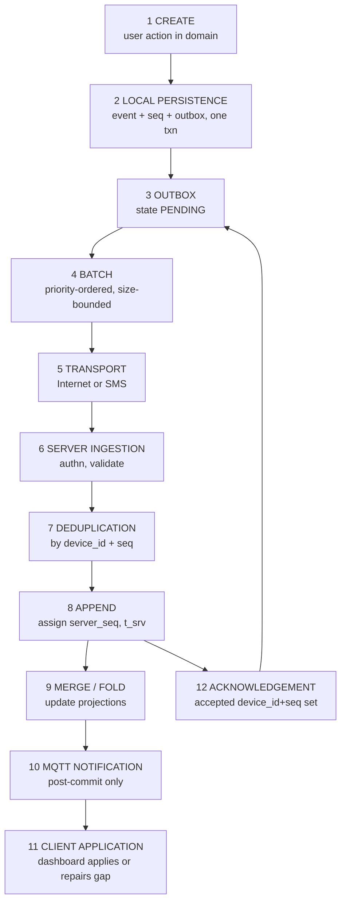
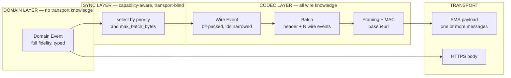

# RescueNet AI — Data and Event Model (v1.0)

**Date:** 2026-08-22 · **Stage:** Data model design · **Target:** Minimum Demonstrable Spine (D-03)
**Baseline:** [`06`](06-system-architecture.md) architecture · [`07`](07-technology-selection.md) stack — **neither is modified here**
**Inputs:** [`01`](01-requirements-analysis.md) · [`02`](02-prototype-scope.md) · [`03`](03-feasibility-analysis.md) · [`04`](04-feasibility-validation.md) · [`05`](05-final-decisions.md)

> **No implementation.** No code, no folders, no dependencies, no UI.

---

## 0. One refinement to record before anything else

`04` §3.1 sized the wire schema with a **3-bit** event-type field (8 types). Part 2 below defines **11 Level-1 event types**, which requires **4 bits**.

| | SP-01a arithmetic | With 4-bit type |
|---|---|---|
| Mixed 19-event batch | 1,342 bits = 168 B | 1,361 bits = **171 B** |
| Data SMS (134 B) | 2 SMS | **2 SMS** |
| Text SMS (120 B) | 2 SMS | **2 SMS** |

**No material change**, and no conclusion in `04` or `05` moves. Recorded because the arithmetic changed and silently carrying the old figure would be wrong. **DM-01.**

---

# PART 1 — Canonical event model

## 1.1 The canonical event

Every operational fact in RescueNet is one immutable event with this shape. There is exactly one event structure; event types differ only in their `payload`.

| Field | Type | Meaning |
|---|---|---|
| `device_id` | uint (12-bit on wire) | Device that authored the event. Issued at enrolment |
| `seq` | uint (20-bit on wire) | Strictly monotonic per-device counter. **`(device_id, seq)` is the event identity — D-05** |
| `type` | enum (4-bit on wire) | One of the 11 Level-1 event types (Part 2) |
| `entity_type` | enum | `CELL` · `TEAM` · `SURVIVOR` · `RESOURCE` · `INCIDENT` · `GRID` · `DEVICE` · `ASSIGNMENT` |
| `entity_id` | type-specific | The subject. Narrow integer on the wire, canonical identifier in the domain |
| `payload` | type-specific | Only the fields that type requires (Part 2) |
| `t_dev` | timestamp | When the **device** believed the action occurred |
| `t_srv` | timestamp | When the **server** received and committed it |
| `server_seq` | bigint | Global monotonic acceptance order. **Ordering authority** |
| `schema_version` | uint | Version of the event schema this event was written against (Part 14) |
| `responder_id` | uint | Who performed the action |
| `team_id` | uint | Which team they acted as, **at that moment** |
| `agency_id` | uint | Which agency they belonged to, **at that moment** |
| `incident_id` | uint | Scope |
| `received_via` | enum | `INTERNET` · `SMS` — provenance, server-set |

### 1.2 Two fields that deliberately do **not** exist on the event

| Absent field | Why |
|---|---|
| **`priority`** | Priority is a **pure function of `type`** (Part 2 table). Storing it per event wastes wire bits and creates a second source of truth that could disagree with the type. The outbox computes it. **DM-02** |
| **`mac` / integrity data** | Integrity is a **batch** property, not an event property. One truncated MAC covers a whole batch (`06` §8, AD-24). Per-event MACs would multiply cost by the batch size for no security gain. **DM-03** |

Attribution (`responder_id`, `team_id`, `agency_id`) **is** stored per event rather than looked up from the responder's current team, because attribution is a **point-in-time historical fact**. A responder reassigned to another team must not retroactively change who searched B-14. **DM-04**, traces to PS-B7, FR-1002.

## 1.3 Field classification (A–G)

| Field | A: device | B: server | C: immutable | D: mutable | E: dedup | F: ordering only | G: display only |
|---|:--:|:--:|:--:|:--:|:--:|:--:|:--:|
| `device_id` | ✅ | | ✅ | | ✅ | | |
| `seq` | ✅ | | ✅ | | ✅ | | |
| `type` | ✅ | | ✅ | | | | |
| `entity_type` | ✅ | | ✅ | | | | |
| `entity_id` | ✅ | | ✅ | | | | |
| `payload` | ✅ | | ✅ | | | | |
| `t_dev` | ✅ | | ✅ | | | | ✅ |
| `responder_id` | ✅ | | ✅ | | | | |
| `team_id` | ✅ | | ✅ | | | | |
| `agency_id` | ✅ | | ✅ | | | | |
| `incident_id` | ✅ | | ✅ | | | | |
| `schema_version` | ✅ | | ✅ | | | | |
| `server_seq` | | ✅ | ✅ | | | ✅ | |
| `t_srv` | | ✅ | ✅ | | | | ✅ |
| `received_via` | | ✅ | ✅ | | | | ✅ |

**Note the empty "mutable" column.** No field of any event is ever mutable. Everything that appears to change in this system is a projection (Part 7). **DM-05**, traces to AD-01, P-1.

**Dedup uses `(device_id, seq)` and nothing else.** Not a hash, not a UUID, not a content digest. **DM-06 / D-05.**

**`server_seq` is used for ordering and for nothing else** — never as a timestamp, never as causality (Part 8).

## 1.4 Why not UUIDs

| | UUIDv4 | `(device_id, seq)` |
|---|---|---|
| Wire cost | 16 B/event | **4 B/event** |
| Events per 134 B SMS | ~5 | ~16 |
| Offline assignable | Yes | Yes |
| Detects device gaps | **No** | **Yes** — a missing `seq` is visible |
| Ordering within a device | No | **Yes, free** |

UUIDs cost 4× the bytes and provide strictly less information. Rejected. **DM-06**, `04` §3.1 finding 4.

---

# PART 2 — Level-1 event types

**Eleven types. No more.** Two things people expect to see here are deliberately absent:

- **There is no `DUPLICATE_SEARCH` event.** Duplicate search effort is a **derived predicate** over `CELL_STATUS_REPORTED`, not a fact anyone observes or authors. Emitting it would create a second source of truth that could disagree with the log. **DM-07**, AD-22, D-01b.
- **There are no sync/acknowledgement events.** Acks are a transport-protocol concern, not a domain fact. Putting them in the log would roughly double its size and pollute the audit history with plumbing. **DM-08.**
- **There are no separate audit events.** The log *is* the audit trail (Part 13). **DM-09.**

## 2.1 Server-authored control events

| # | Type | Producer | Required payload | Optional | Consumers | Offline | Priority | Merge | Append-only | Current state |
|---|---|---|---|---|---|---|---|---|---|---|
| 1 | `INCIDENT_DECLARED` | Server (commander via REST) | `name`, `disaster_type`, `origin_lat`, `origin_lon`, `started_at` | `notes` | All | Cached on device at enrolment | ROUTINE | Single occurrence per incident | ✅ | Direct read |
| 2 | `GRID_GENERATED` | Server | `origin_lat`, `origin_lon`, `cell_size_m`, `rows`, `cols`, `bearing_deg` | — | All | Cached | ROUTINE | Single occurrence; immutable once published | ✅ | **Cells derived parametrically** |
| 3 | `TEAM_REGISTERED` | Server | `team_id`, `callsign`, `agency_id`, `agency_type` | — | All | Cached | ROUTINE | Union by `team_id` | ✅ | Fold to roster |
| 4 | `DEVICE_ENROLLED` | Server | `device_id`, `team_id`, `responder_id` | `label` | Server, owning device | Cached | ROUTINE | Union by `device_id` | ✅ | Fold to device roster |
| 5 | `ASSIGNMENT_ISSUED` | Server (commander) | `assignment_id`, `team_id`, `cell_ids[]` | `note` | Assigned team, dashboard | Delivered on next sync | ROUTINE | Last by `server_seq` per cell | ✅ | Fold per cell |
| 6 | `ASSIGNMENT_REVOKED` | Server (commander) | `assignment_id` | `reason` | Assigned team, dashboard | Delivered on next sync | ROUTINE | Last by `server_seq` per cell | ✅ | Fold per cell |

**`GRID_GENERATED` is one event, not 5,000.** The grid is defined **parametrically** — origin, cell size, rows, cols — and every cell's geometry and label is computed deterministically from `cell_index`. A 5,000-cell grid therefore costs one event of ~30 bytes instead of 5,000 events. Cell labels are **derived, never transmitted** — the label rule is fixed in docs/05 §10 (`<COLUMN LETTERS>-<ROW NUMBER>`, 1-based display, Excel column encoding). **DM-10**, traces to NFR-01, FR-203, FR-204.

## 2.2 Device-authored field events

| # | Type | Producer | Required payload | Optional | Consumers | Offline | Priority | Merge | Append-only | Current state |
|---|---|---|---|---|---|---|---|---|---|---|
| 7 | `CELL_STATUS_REPORTED` | Field device | `cell_index`, `status` ∈ {`IN_PROGRESS`,`SEARCHED`,`NEEDS_RESEARCH`} | — | Dashboard, all devices | **Fully offline** | ROUTINE | **Set union** in log; **last by `server_seq`** for display | ✅ | Fold per cell |
| 8 | `SURVIVOR_REPORTED` | Field device | `cell_index`, `person_count`, `survivor_status` ∈ {`TRAPPED`,`ACCESSIBLE`,`EXTRICATED`,`DECEASED`} | `triage`, `rel_lat`, `rel_lon` | Dashboard | **Fully offline** | **CRITICAL** | **Set union — never merged away** | ✅ | Union list |
| 9 | `RESOURCE_DELTA_REPORTED` | Field device | `item_id`, `qty_delta` (signed) | — | Dashboard | **Fully offline** | ROUTINE | **Additive sum** | ✅ | Sum of deltas |
| 10 | `POSITION_REPORTED` | Field device | `rel_lat`, `rel_lon` | `accuracy_m`, `cell_index` | Dashboard | **Fully offline** | ROUTINE | Last by `server_seq` per team | ✅ | Latest per team |
| 11 | `TEAM_STATUS_REPORTED` | Field device or commander | `team_status` ∈ {`ACTIVE`,`STANDBY`,`OUT_OF_SERVICE`} | `note` | Dashboard | **Fully offline** | ROUTINE | Last by `server_seq` per team | ✅ | Latest per team |

**Priority is derived from this column, not stored** (DM-02). Exactly one type is `CRITICAL` at Level 1: `SURVIVOR_REPORTED`. That is D-04's two-tier scheme with the minimum possible complexity. `SOS` joins CRITICAL at Level 2.

**Wire type codes are fixed and never reused**, even if a type is retired (Part 14).

---

# PART 3 — Aggregates and entities

| Entity | Purpose | Primary key | Important fields | Relationships | Authoritative source | Cached on device | Mutable state derived from events |
|---|---|---|---|---|---|---|---|
| **Incident** | Scope for everything | `incident_id` | name, disaster_type, origin, started_at | 1→1 Grid; 1→N Team | `INCIDENT_DECLARED` | ✅ | ✅ |
| **Grid** | Parametric definition of the search area | `incident_id` | origin, cell_size_m, rows, cols, bearing | 1→N GridCell (derived) | `GRID_GENERATED` | ✅ | ✅ |
| **GridCell** | One searchable cell | `(incident_id, cell_index)` | label (derived), bounds (derived), status (folded) | N→1 Grid; N→1 Assignment | **Derived** — no table row until it has state | ✅ | ✅ |
| **Agency** | Participating organisation | `agency_id` | name, agency_type | 1→N Team | `TEAM_REGISTERED` | ✅ | ✅ |
| **Team** | Operating unit | `team_id` | callsign, agency_id, status (folded) | N→1 Agency; 1→N Device | `TEAM_REGISTERED`, `TEAM_STATUS_REPORTED` | ✅ | ✅ |
| **Responder** | Individual | `responder_id` | display name | N→1 Team | `DEVICE_ENROLLED` | ✅ | ✅ |
| **Device** | One handset | `device_id` | team_id, responder_id, enrolled_at | N→1 Team | `DEVICE_ENROLLED` | own only | ✅ |
| **DeviceCredential** | Token hash + HMAC secret | `device_id` | token_hash, hmac_secret, issued_at | 1→1 Device | **Server table — NOT in the event log** | own secret only | ❌ |
| **Assignment** | Cells given to a team | `assignment_id` | team_id, cell_ids[], state (folded) | N→1 Team; N→M GridCell | `ASSIGNMENT_ISSUED/REVOKED` | ✅ own | ✅ |
| **SurvivorReport** | A reported survivor find | `(device_id, seq)` of the event | cell, count, status, triage | N→1 GridCell | `SURVIVOR_REPORTED` | ✅ | ✅ (union) |
| **ResourceItem** | Catalogue entry | `item_id` | name, category | 1→N ResourceStock | Seeded reference data | ✅ | ❌ |
| **ResourceStock** | Quantity held by a team | `(team_id, item_id)` | qty (folded) | N→1 Team | `RESOURCE_DELTA_REPORTED` | ✅ | ✅ (additive) |
| **TeamPosition** | Latest known location | `team_id` | rel_lat, rel_lon, t_srv, age | 1→1 Team | `POSITION_REPORTED` | ✅ | ✅ |

**`DeviceCredential` is the one entity deliberately kept out of the event log.** Secrets do not belong in an append-only, replicated, audit-visible structure. The log records *that* a device enrolled; the credential store holds *what* it can prove. **DM-11**, traces to `06` §14.

**`GridCell` has no row until it has state.** An untouched cell is fully described by the grid parameters, so an unsearched 5,000-cell grid occupies zero rows. **DM-12.**

---

# PART 4 — Event lifecycle, stage by stage, with failure behaviour



| # | Stage | Failure mode | Behaviour |
|---|---|---|---|
| 1 | **Create** | Domain validation fails | Rejected before persistence; user told immediately. Nothing enters the log |
| 2 | **Local persistence** | Crash or power loss mid-transaction | Transaction rolls back atomically. Event, `seq` and outbox row all absent — **never partially present**. The `seq` value may be consumed and left as a gap; gaps are legal (AD-10, DM-13) |
| 3 | **Outbox** | Disk full | Write fails, user is told, action not confirmed. **The system never reports success for an unpersisted action** |
| 4 | **Batch** | Batch exceeds transport capacity | Codec packs only what fits; the remainder stays `PENDING`. **Never truncates an event** (Part 10) |
| 5 | **Transport** | Send fails, times out, or no transport available | Outbox rows return to `PENDING` with incremented `attempt_count` and a backoff. **Nothing is discarded** |
| 6 | **Ingestion** | Auth fails, or MAC invalid | Whole batch rejected, error returned. Client retries; events stay `PENDING`. A batch that repeatedly fails auth raises a diagnostic, never a silent drop |
| 6 | | Event fails validation (bad schema, unknown cell, actor/team mismatch) | **That event** is rejected with a reason; the rest of the batch is still accepted. Rejections are logged and surfaced — never silent |
| 7 | **Deduplication** | Event already present | **Accepted and reported as accepted.** Idempotent, not an error (AD-28, Part 5) |
| 8 | **Append** | Database unavailable | Whole batch fails; no partial commit. Client retries; idempotency makes the retry safe |
| 9 | **Merge / fold** | Projection code throws | **The event is already committed and is not lost.** The projection is marked stale and rebuilt from the log. Projections are disposable (AD-27) |
| 10 | **MQTT notify** | Broker down, or publish fails | **Ignored — degrades latency only.** The event is committed; the dashboard's gap check repairs it (AD-15, AD-17) |
| 11 | **Client apply** | Gap detected in `server_seq` | REST delta pull from `last_applied_server_seq`; long gap falls back to a fresh snapshot |
| 12 | **Acknowledgement** | Ack lost in transit | Events stay `PENDING`, are re-sent, and are de-duplicated server-side. **A lost ack costs one redundant send, never a lost event** |

**The invariant across all twelve stages:** an event that has been locally persisted is never removed from the local log by any failure at any later stage.

---

# PART 5 — Idempotency

| Scenario | Behaviour | Mechanism |
|---|---|---|
| **Same event arrives twice** | Second arrival is a no-op; the server reports it **accepted** | `(device_id, seq)` primary key; `INSERT … ON CONFLICT DO NOTHING`, then return the full accepted set |
| **Same batch arrives twice** | Every event in it is individually de-duplicated. No batch-level state exists to corrupt | Batches are **not** entities; only events are (DM-14) |
| **SMS duplicates an event** | Identical to the above. SMS retries and multi-path delivery are safe by construction | Same primary key |
| **Reconnect resends an event** | Safe. The client re-sends everything not `ACKED`, including things the server already has | Same primary key |
| **Two devices create the same logical action** | **Both are kept.** They have different `(device_id, seq)` and are different facts: *Team A searched B-14* and *Team B searched B-14* are both true | Set union — and this is exactly the D-01b duplicate-search scenario, verified 13/13 in `04` §3.2 |

**The last row is the important one.** Two devices performing "the same" action do not produce a conflict to resolve. They produce two true observations, both of which must survive, because the *duplication itself is the finding the commander needs* (PS-B4). **DM-15.**

**Nothing is silently lost anywhere in this table**, because no code path exists that overwrites or deletes an event.

---

# PART 6 — Offline outbox

## 6.1 Schema

| Column | Type | Purpose |
|---|---|---|
| `device_id`, `seq` | uint | FK to the local event; also the outbox primary key |
| `state` | enum | `PENDING` · `IN_FLIGHT` · `ACKED` |
| `priority` | enum | Derived from event type at insert (DM-02) |
| `attempt_count` | int | Drives backoff |
| `next_attempt_at` | timestamp | Persisted so backoff survives restart |
| `last_error` | text | Diagnostics only |
| `batch_ref` | uint, nullable | Which in-flight batch carries it |
| `first_queued_at` | timestamp | Feeds the "unsent for N hours" diagnostic |
| `rejected_code` | text, nullable | Server rejection code, e.g. `UNKNOWN_CELL` (**AP-14**) |
| `rejected_message` | text, nullable | Human-readable server explanation |
| `rejected_at` | timestamp, nullable | When the permanent verdict was received |
| `rejected_batch_ref` | text, nullable | `batch_id` the verdict arrived in, for server-log correlation |

**All four rejection columns are delivery metadata on the outbox row. None is part of the canonical event** (Part 1), none is ever transmitted, and none appears in the `event` table. **DM-39.**

## 6.2 The state machine — three states, deliberately

```mermaid
stateDiagram-v2
    [*] --> PENDING: inserted in the same txn as the event
    PENDING --> IN_FLIGHT: packed into a batch and handed to a transport
    IN_FLIGHT --> ACKED: server confirms persisted
    IN_FLIGHT --> PENDING: transport failure, timeout, or retryable rejection
    IN_FLIGHT --> REJECTED: server returns a PERMANENT verdict
    PENDING --> PENDING: backoff elapsed, retry
    ACKED --> [*]: outbox row pruned; THE EVENT REMAINS
    note left of PENDING
        No RETRY state: retry is
        PENDING plus attempt_count
        and next_attempt_at
    end note
    note right of IN_FLIGHT
        On app start, every IN_FLIGHT
        row reverts to PENDING.
        Re-sending is always safe.
    end note
    note right of REJECTED
        DELIVERY state only.
        The event stays in the local
        log permanently and remains
        auditable. The outbox row is
        NEVER pruned, so the reason
        survives.
    end note
```



**One state you might expect, and why it is absent:**

- **No `RETRY` state.** Retry is not a distinct condition — it is `PENDING` with a future `next_attempt_at`. A separate state would duplicate information and create illegal combinations. **DM-16.**

**`REJECTED` — amended 2026-08-22 on approval of AP-14 (`09` §0).**

DM-17 originally stated that **no terminal state exists**, reasoning that a terminal state implies discard. That reasoning was about **transmission** failure, and it still holds: an event that cannot be *sent* stays `PENDING` indefinitely, with backoff capped and the condition surfaced as a diagnostic — never as data loss.

**Server rejection is a distinct case** the original model did not cover. An event that fails *semantic* validation will fail identically on every retry, consuming the scarcest resource in the system. `REJECTED` is therefore a terminal **delivery** state with these binding properties:

| Property | Guarantee |
|---|---|
| Scope | **Delivery state only.** It describes the outbox row, never the event |
| Event retention | The domain event **remains permanently in the local event log** and is fully auditable there |
| Deletion | **An event is never deleted because it was rejected** |
| Row retention | **`REJECTED` outbox rows are never pruned** — unlike `ACKED` rows — so the rejection reason survives for diagnosis. **DM-40** |
| Entry condition | Only on a server verdict with `retryable: false`. **Retryable failures remain `PENDING`** |
| Blocking | A `REJECTED` row is not `PENDING`, so it is never selected for batching and **cannot block later valid events** |
| Exit | **No automatic transition out.** Manual re-queue is a Level-2 diagnostic affordance, deliberately not built at Level 1 |

**DM-17 amended.**

## 6.3 Retry, backoff and retention

| Concern | Rule |
|---|---|
| **Backoff** | Exponential with ±20% jitter: `min(base × 2^attempt, cap)` |
| **Internet transport** | `ROUTINE` base **2 s**, cap **5 min** · `CRITICAL` base **1 s**, cap **60 s** (**DM-56**) |
| **SMS transport** | `ROUTINE` base **60 s**, cap **30 min** · `CRITICAL` base **10 s**, cap **5 min** (**DM-56**) — deliberately slow because SMS is METERED and the gateway downlink is throttle-constrained (TL-4) |
| **Priority interaction** | `CRITICAL` events use the shorter base and lower cap above; `ROUTINE` events are never sent over a METERED transport while internet is absent (AD-09) |
| **Max local retention** | Events: for the incident's duration. Outbox rows: pruned **only** when `ACKED`, and only under storage pressure. **`REJECTED` rows are never pruned** (DM-40) |
| **Storage pressure** | If the local store approaches its bound, prune `ACKED` outbox rows first, then received (non-authored) events, which are recoverable by delta pull. **`PENDING` rows and locally authored events are never pruned** (FR-811, DM-18) |
| **After restart** | `IN_FLIGHT` → `PENDING`. Backoff resumes from persisted `next_attempt_at`. Nothing is re-derived from memory |
| **After crash** | Identical to restart — the write transaction guarantees no partial state exists (AD-10) |
| **After connectivity returns** | The §5.4 sequence in `06`: drain outbox by priority, then delta-pull downlink, then recompute projections |

### 6.3.1 Backoff values in full — **DM-56** (added 2026-08-23)

The table above previously said only that `CRITICAL` uses *"a shorter base and a lower cap"*,
without naming either number. The M7 preflight raised that as a blocker; the values are fixed
here. **The formula is unchanged**: `min(base × 2^attempt, cap)` with ±20% jitter.

| Transport | Priority | Base | Cap |
|---|---|---|---|
| Internet | `ROUTINE` | 2 s | 5 min |
| Internet | **`CRITICAL`** | **1 s** | **60 s** |
| SMS | `ROUTINE` | 60 s | 30 min |
| SMS | **`CRITICAL`** | **10 s** | **5 min** |

`ROUTINE` values are unchanged from the original table. Only the two `CRITICAL` rows are new.

**Why CRITICAL is not simply "as fast as possible".** `CRITICAL` is `SURVIVOR_REPORTED`
(D-04), so a retry that arrives late can cost a life — but an unbounded-rate retry on a
degraded link is how a client denies service to itself and to every other device sharing the
gateway. The SMS caps stay far above the Internet ones for exactly the reason the row already
gives: SMS is METERED and the gateway downlink is throttle-constrained (TL-4). A CRITICAL SMS
retry every 10 s rising to 5 min is aggressive for that link without breaking the throttle
budget `04` §3.1 established.

**Unchanged by this decision:** retry semantics (DM-16 — no `RETRY` state), priority semantics
(D-04, AD-09), transport ownership (`06` §7, `12` §3.4), and the AP-21 / AP-22 rejection rules.
Backoff still governs `PENDING` rows only; a `REJECTED` row is never retried at all. **DM-56.**

---

# PART 7 — Merge and fold semantics

Starting point: `04` §3.2, 13/13 passing. **No rule below says "the server resolves conflicts."** Each is a total function of the event log.

## 7.1 Operation classification

| Operation class | Applies to | Rule |
|---|---|---|
| **Append (log level)** | Every event, without exception | Insert keyed by `(device_id, seq)` |
| **Set union** | `CELL_STATUS_REPORTED`, `SURVIVOR_REPORTED`, `POSITION_REPORTED`, `RESOURCE_DELTA_REPORTED` | Union of event identities. Commutative, associative, idempotent |
| **Additive** | `RESOURCE_DELTA_REPORTED` | Sum of signed deltas |
| **Last-by-`server_seq`** | Cell display status, team status, latest position, assignment holder | `argmax(server_seq)` over the relevant event subset |
| **Derived predicate** | Duplicate search flag, coverage metrics | Pure function over folded state. **Coverage is a second-order projection of `cell_state`, computed server-side only** (`09` §5.3, AP-24) |

## 7.2 The rules, stated exactly

| # | Concern | Deterministic rule |
|---|---|---|
| 1 | **Duplicate search** | `DuplicateSearchView(cell) = TRUE` **iff** `COUNT(DISTINCT team_id)` over `{e : e.type = CELL_STATUS_REPORTED ∧ e.entity_id = cell ∧ e.payload.status = SEARCHED}` **≥ 2**. Order-independent, so it cannot be affected by AL-05 (Part 8) |
| 2 | **Inventory deltas** | `Stock(team, item) = Σ payload.qty_delta` over all matching `RESOURCE_DELTA_REPORTED`. Commutative — **no conflict is representable**. Negative results are displayed, not clamped: a negative reading is information |
| 3 | **Team status** | `TeamStatus(team) = payload.team_status` of the event with `MAX(server_seq)` among `TEAM_STATUS_REPORTED` for that team |
| 4 | **Assignments** | `Holder(cell) =` for the event with `MAX(server_seq)` among `ASSIGNMENT_ISSUED`/`ASSIGNMENT_REVOKED` touching that cell: `team_id` if ISSUED, `NULL` if REVOKED. **All assignment events originate from the single online dashboard through one server (D-01), so `server_seq` is a genuine total order over them and no concurrent assignment is structurally possible** |
| 5 | **Survivor reports** | `SurvivorList(cell) =` the **full set** of `SURVIVOR_REPORTED` events for that cell. **No deduplication, no merging, no suppression at Level 1** (AL-11). Two teams reporting the same survivors produce two entries, both attributed |
| 6 | **Grid cell status** | `CellState(cell) = payload.status` of the event with `MAX(server_seq)` among `CELL_STATUS_REPORTED` for that cell; `ASSIGNED` if none but a live assignment exists; otherwise `UNSEARCHED` |

## 7.3 Tie-breaking

`server_seq` is a **strictly monotonic single-writer sequence**, so ties are impossible by construction. No secondary tie-break rule is needed, and none is defined — defining one would imply ties can occur. **DM-19.**

## 7.4 Why the display fold never destroys information

Rules 3, 4 and 6 select one value **for display**. The events they did not select remain in the log, are returned by the audit query (Part 13), and are visible in `CellHistory`. **Folding is a read-time projection, never a write-time deletion.** **DM-20.**

---

# PART 8 — Ordering

## 8.1 Five distinct concepts, and what each may mean

| Concept | Definition | **Allowed to mean** | **Never allowed to mean** |
|---|---|---|---|
| **Device sequence** (`seq`) | Per-device monotonic counter | "This device created A before B." **Genuine causal order within one device** (program order) | Anything about other devices |
| **Event timestamp** (`t_dev`) | Device wall clock at creation | Display; audit; human judgement about real-world timing | Ordering, of any kind. The clock may be wrong by hours |
| **Server sequence** (`server_seq`) | Global monotonic counter at commit | "The server learned of A before B." Total order of **acceptance** | Causal order. Occurrence order. Time |
| **Arrival order** | Physical order of receipt | Identical to `server_seq` order by construction | Occurrence order |
| **Causal order** | Real-world happened-before | **Known only within a single device.** Across devices it is **not tracked at Level 1** | Being inferred from `server_seq` or `t_dev` |

## 8.2 `server_seq` is explicitly not causal

Two events may occur in one real-world order and be accepted in another, because acceptance order depends on which device reached connectivity first — not on when anything happened. `server_seq` orders *the server's knowledge*, not *the world*. **DM-21**, `06` AD-13.

## 8.3 AL-05, addressed concretely

**The scenario.** Team Alpha searches B-14 at 10:00 and stays offline. Team Bravo searches B-14 at 10:05 and reaches internet at 10:06. Bravo's event gets `server_seq = 900`. Alpha syncs at 11:30 and gets `server_seq = 1200`. Fold rule 6 selects Alpha's event as the displayed status — even though Bravo searched **later** in reality.

**What actually breaks:** only the *displayed status* of a cell when multiple status events exist, and only when it matters which was last. For B-14 both events say `SEARCHED`, so the displayed value is identical either way.

**Why the flagship demo is unaffected.** The duplicate-search predicate (rule 1) is a **set-cardinality test with no ordering term**. AL-05 cannot change its result. **D-01b's demonstration is structurally immune to this limitation** — which is a fortunate consequence of choosing a set predicate over an ordered rule, and worth stating plainly rather than discovering on stage. **DM-22.**

**Level-1 mitigation:** the audit view shows `t_dev`, `t_srv` and `server_seq` side by side, so a human can see the inversion. **Not corrected at Level 1.**
**Level-2 fix:** record each device's observed clock offset at successful sync and use it to order display candidates. Deferred (FR-812).

---

# PART 9 — Low-bandwidth profile per event type

**Grid size is bounded by the wire schema.** `cell_index` occupies a **13-bit** field, so the Level-1 maximum grid is **`MAX_CELLS` = 8,191 cells**, with valid indices 0…8,190 and 8,191 reserved. This limit is normative in `09` §10.5 and is **derived from the field width, not chosen independently** — the two must never drift apart. The 5,000-cell figure in NFR-09 is an evaluation *target*, not the maximum.

**Never repeated per event** — carried once in the batch header and applied to every event in it: `device_id`, `team_id`, `agency_id`, `incident_id`, `schema_version`, and a base timestamp against which each event carries a small delta. **DM-23**, `04` §3.1.

| Type | Min wire payload | Omittable fields | Batching | Priority | Compression | SMS suitable |
|---|---|---|---|---|---|---|
| `CELL_STATUS_REPORTED` | ~8 B | none — already minimal | Yes, high density | ROUTINE | No (AD-20) | ✅ |
| `SURVIVOR_REPORTED` | ~13 B | `triage`, `rel_lat/lon` when the cell is precise enough | Yes; **packed first** | **CRITICAL** | No | ✅ |
| `RESOURCE_DELTA_REPORTED` | ~8 B | none | Yes | ROUTINE | No | ✅ |
| `POSITION_REPORTED` | ~9 B | `accuracy_m`, `cell_index` | Yes; **dropped first under pressure** | ROUTINE | No | ❌ **NEVER over SMS** — absolute rule, `09` §6.3 (ratified 2026-08-24, M8-7). Internet path only |
| `TEAM_STATUS_REPORTED` | ~6 B | `note` — **never sent over SMS** | Yes | ROUTINE | No | ✅ (without `note`) — SMS layout in `09` §6.6.2 |
| `ASSIGNMENT_ISSUED` | ~6 B + 2 B/cell | `note` | Yes | ROUTINE | No | Downlink only, receive-mostly gateway (D-06) |
| `ASSIGNMENT_REVOKED` | ~5 B | `reason` | Yes | ROUTINE | No | Downlink only |
| `GRID_GENERATED` | ~30 B | none | Single event (DM-10) | ROUTINE | No | ✅ — one message, not 5,000 |
| `INCIDENT_DECLARED` | ~20 B | `notes` | Single | ROUTINE | No | ✅ |
| `TEAM_REGISTERED` | ~8 B | none | Yes | ROUTINE | No | ✅ |
| `DEVICE_ENROLLED` | ~7 B | `label` | Yes | ROUTINE | No | Enrolment is HTTPS-only at L1 |

**Compression: none, anywhere.** Bit-packed payloads of ~170 B carry little residual redundancy, and compression framing would consume most of any gain (AD-20).

**Never sent at all:** derived values (cell labels, cell bounds, coverage metrics, duplicate flags), unchanged state, acknowledgements of acknowledgements, free-text over SMS, media at Level 1.

**The domain schema is transport-independent.** Nothing in Parts 1–3 mentions bytes, segments or SMS. The table above describes what the *codec* does with domain events — it does not change what they are. **DM-24.**

---

# PART 10 — The SMS encoding boundary



## 10.1 The four rules of the boundary

| # | Rule |
|---|---|
| 1 | **The codec is a lossless bijection over what it accepts.** Decoding a batch yields domain events identical to those encoded. **DM-25** |
| 2 | **The codec never truncates.** If a field cannot be represented within the wire schema, the event is **not sent over that transport** and remains `PENDING` for a transport that can carry it. Truncation would silently alter a domain fact — forbidden |
| 3 | **The codec never reorders, merges, drops or synthesises events.** It changes representation only |
| 4 | **Semantics live above the codec.** Priority, merge rules and validation are domain and sync concerns. The codec knows sizes and layout, nothing else |

## 10.2 What each stage owns

| Stage | Owns | Must not know |
|---|---|---|
| Domain event | Meaning, types, attribution | Bytes, transports |
| Sync selection | Priority, `max_batch_bytes` as a number | That SMS exists |
| Wire event | Bit layout, id narrowing, delta timestamps | Merge rules |
| Batch | Header, shared fields, event count | Domain semantics |
| Framing | `batch_id`, part index/total, MAC | Event meaning |
| SMS payload | Segmentation, alphabet | Everything above |

**Internet transport uses the same domain events but a different representation** (JSON over HTTPS), which is the proof that the boundary is real: two transports, one semantic model, no shared wire assumptions. **DM-26.**

## 10.3 D-02a / T-23 — CLOSED, and the wire format is ratified

**D-02a and T-23 closed 2026-08-24: the encoding is GSM-7 text**, `max_batch_bytes` **120 B**.
SP-01b-A Q1 failed (0/10 binary delivered, 10/10 `GENERIC_FAILURE`), so the binary/134 B path
is rejected on evidence (`05` §1.2a, `07` T-23, `09` §6.1).

**The complete wire format — header widths, per-event layouts, delta widths, framing, MAC
coverage, ACK layout and the byte budget — is ratified in `09` §6.6 (DM-57).** That section is
authoritative for every bit width.

DM-27 still holds and is why this was cheap: the encoding choice lived **entirely inside the
framing stage**. No domain event, no merge rule, no projection and no database column changed
when it resolved.

---

# PART 11 — PostgreSQL logical schema

## 11.1 Source of truth

### `event` — the only authoritative operational table

| Column | Type | Notes |
|---|---|---|
| `device_id` | `int` | PK part 1 |
| `seq` | `bigint` | PK part 2 |
| `server_seq` | `bigint GENERATED ALWAYS AS IDENTITY` | `UNIQUE NOT NULL` — the ordering authority |
| `incident_id` | `int` | FK → `incident` |
| `type` | `smallint` | Wire code, never reused (Part 14). Values ratified in §14.1 |
| `entity_type` | `smallint` | Storage code, not independently transmitted. Values ratified in §14.1 |
| `entity_id` | `bigint` | Polymorphic by `entity_type` — **deliberately not a FK** (DM-28) |
| `payload` | `jsonb` | Type-specific fields only |
| `t_dev` | `timestamptz` | Device clock — display/audit only |
| `t_srv` | `timestamptz DEFAULT now()` | Server receipt |
| `schema_version` | `smallint` | Part 14 |
| `responder_id`, `team_id`, `agency_id` | `int` | Point-in-time attribution (DM-04) |
| `received_via` | `smallint` | `INTERNET` / `SMS`, server-set. Values ratified in §14.1 |

- **PK:** `(device_id, seq)` — makes ingestion idempotent by construction
- **Unique:** `server_seq`
- **Indexes:** `(server_seq)` for delta pulls · `(incident_id, server_seq)` · `(entity_type, entity_id, server_seq)` for "what happened to B-14" · `(team_id, server_seq)` · `(type, incident_id)`
- **Append-only enforcement:** the application role is granted `INSERT` and `SELECT` only — **no `UPDATE`, no `DELETE`**. This is enforced by permission, not convention. **DM-29**

### Reference and credential tables (source of truth, not event-derived)

| Table | PK | Notes |
|---|---|---|
| `incident` | `incident_id` | Also emitted as `INCIDENT_DECLARED`. Gains `password_hash` at M5 (§11.1b) |
| `agency` | `agency_id` | Seeded |
| `resource_item` | `item_id` | Seeded catalogue |
| `device_credential` | `device_id` | `token_hash`, `hmac_secret`, **`role`**, `issued_at`, `revoked_at`. See §11.1b. **Never in the event log** (DM-11) |
| `join_code` | `code` | See §11.1a. **Never in the event log** |

#### §11.1a Join-code storage — **M5-owned** (added 2026-08-23)

`09` endpoint 6 mints join codes and endpoint 1 consumes them, but no table held them.
Both endpoints are M5 (`12` §3.2), so the storage is M5 too. Minimum schema to satisfy the
existing contract — `09` endpoint 6 returns `{join_code, expires_at, max_uses}` and
endpoint 1 fails `409` when a code is exhausted or expired:

| Column | Type | Notes |
|---|---|---|
| `code` | `text` | PK. The short code a responder types |
| `team_id` | `int` | Team the code enrols into |
| `incident_id` | `int` | Scope |
| `expires_at` | `timestamptz` | Drives the `409` expiry case |
| `max_uses` | `int` | Drives the `409` exhaustion case |
| `uses` | `int` | Consumed count; enrolment is **not** idempotent (AP-02) |

**Not created at M4.** Like `device_credential` it is a credential-adjacent artefact and
**never enters the event log** (DM-11 reasoning). No join-code data may appear in `event`.
**DM-42.**

### §11.1b Credential and session contract — **M5-owned** (added 2026-08-23)

Closes the four gaps found by the M5 readiness review. Every value here is a
**storage/issuance** rule; no endpoint semantics in `09` change.

#### `device_credential`

| Column | Type | Notes |
|---|---|---|
| `credential_id` | `bigserial` | **PK.** Surrogate — see DM-50 |
| `device_id` | `int` NULL UNIQUE | Allocated from **1**; 0 reserved for the server (DM-36, TR-22). **`NULL` for COMMANDER sessions** |
| `token_hash` | `text` UNIQUE | **`SHA-256(token)`, hex.** One-way — the bearer token itself is never persisted |
| `hmac_secret` | `bytea` NULL | **Stored recoverably.** See DM-47. `NULL` for COMMANDER sessions, which never sign SMS batches |
| `role` | `text` | Exactly one of `FIELD` · `GATEWAY` · `COMMANDER`. **DM-44** |
| `incident_id` | `int` NULL | **Incident scope. Populated for COMMANDER sessions** (DM-50). For `FIELD`/`GATEWAY` it may be `NULL`; their scope is derived from `DEVICE_ENROLLED` |
| `issued_at` | `timestamptz` | Session expiry is **derived**: `issued_at + 24 h` (DM-46). No `expires_at` column |
| `revoked_at` | `timestamptz` NULL | Revocation is effective at next contact (AL-04) |

#### Why the primary key is a surrogate — **DM-50**

`COMMANDER` is one of the three credential roles (DM-44), so sessions live in this table
rather than a separate one. But a session is **not a device**, and minting a `device_id`
for every commander login would consume identity space that D-05/TR-22 reserves for real
handsets (1–4,095).

The primary key is therefore a surrogate `credential_id`, with `device_id` **nullable and
unique**: device credentials carry one, commander sessions carry `NULL`. The device
identity model is untouched — **no `device_id` is consumed by a session.**

`incident_id` closes the gap found during M5 implementation: endpoint 2 must return an
incident, endpoint 9 must enforce "caller must belong to the incident", and `09` §2.6 must
reject `WRONG_INCIDENT`. A `FIELD`/`GATEWAY` device's incident is derivable from its
`DEVICE_ENROLLED` event; a commander session has no such event, so it records the scope
here.

**`role` is the persisted authority.** The value returned by enrolment is the value
stored here, and it is the value every later authorization decision reads. No separate
role table — the authoritative documents do not require one.

#### Opaque bearer token — **DM-43**

| Property | Value |
|---|---|
| Generation | `secrets.token_urlsafe(32)` — 32 random bytes from the OS CSPRNG |
| Representation | URL-safe base64 without padding, **43 characters**, ~256 bits of entropy |
| Persisted | **Only `SHA-256(token)`.** The token is returned once, at issuance, and never again |
| Rationale | 256 bits of uniform entropy needs no salt and no stretching; a fast one-way hash is correct *for a random token* and wrong for a human password (contrast §11.1c) |

#### Join code — **DM-45**

| Property | Value |
|---|---|
| Generation | `secrets.choice` over an unambiguous alphabet |
| Alphabet | `ABCDEFGHJKMNPQRSTUVWXYZ23456789` — 31 symbols, excluding `I`, `L`, `O`, `0`, `1` |
| Length | **6 characters**, matching the documented example `K7QM4P` (`09` endpoint 6) |
| Entropy | ~29.7 bits |
| Why short | It is typed by a responder under stress and spoken over radio (MC-05, FR-104). The entropy is deliberately modest and is bounded by `expires_at`, `max_uses`, and the fact that a code grants enrolment into **one team of one incident** only. Trust-on-first-use is already an accepted limitation (AL-04) |

Fields and semantics of `join_code` are unchanged from §11.1a; expiry and exhaustion
continue to produce the documented `409`.

#### Session token — **DM-46**

| Property | Value |
|---|---|
| Generation / storage | Same as the device token: `secrets.token_urlsafe(32)`, persisted as `SHA-256` |
| **Lifetime** | **24 hours** from issuance |
| Refresh | **None.** AP-17 forbids a refresh flow; the commander re-authenticates |
| Revocation | Effective at next contact, as for device tokens |

#### Why `token_hash` is one-way but `hmac_secret` is not — **DM-47**

They serve opposite verification directions, so they must be stored differently.

| | `token_hash` | `hmac_secret` |
|---|---|---|
| Server needs | To **compare** a presented value | To **recompute** a MAC |
| Therefore | One-way hash suffices | The secret itself is required |
| Stored | `SHA-256(token)` | **Recoverably** |

Storing `hmac_secret` hashed would make MAC verification impossible, since the server
must derive the same HMAC the device did. It is generated from the OS CSPRNG, returned
exactly once at enrolment over TLS, **never logged, never printed, never returned again**,
and never placed in the event log (DM-11).

#### Batch MAC verification is **M8**, not M5 — **DM-49**

The MAC covers the **packed SMS wire bytes** (§10.2 framing: `batch_id`, `part_index`,
`part_total`, `origin_device_id`, `mac`). Verifying it requires the canonical encoding —
which is the codec, delivered at **M8**. **TR-10 is therefore owned by M8** (`11`, `12`
§3.3). It is neither weakened nor deleted.

**M5 still issues and stores `hmac_secret`**, so M8 inherits everything it needs. The
dependency runs M8 → M5, never the reverse.

#### Transitional security limitation until M8 — **DM-51**

Because MAC verification is M8, **author-level authenticity of relayed events cannot be
verified at M5**. The consequences are bounded and stated here so they cannot be mistaken
for an oversight:

| Role | M5 enforcement | Gap until M8 |
|---|---|---|
| `FIELD` | Every submitted event's `device_id` **must equal** the authenticated device. Enforced | None |
| `GATEWAY` | May relay events carrying other devices' `device_id` — this is what a relay does (AP-16) | **The MAC that would prove who authored them is not verified.** A compromised gateway could fabricate events attributed to any team |
| `COMMANDER` | Session-authenticated, incident-scoped | None |

**No replacement MAC encoding has been invented, and the documented MAC contract
(`09` §6.3) is unchanged.** The gap closes when M8 delivers the canonical codec and TR-10.
Until then, any demonstration involving the gateway path must state this plainly.

### §11.1d Enrolment identity defaults — **TEMPORARY, DM-53**

`09` endpoint 1 returns `responder_id` and `agency_id`, but **no document specifies where
either comes from** for a newly enrolled handset. The join code carries `team_id` and
`incident_id`; it carries neither of these.

Rather than invent semantics, M5 uses explicit provisional defaults and records them here:

| Field | Current value | Status |
|---|---|---|
| `responder_id` | **Set equal to `device_id`** | Provisional. One responder per enrolled handset at Level 1 — true for the prototype, not a modelled relationship |
| `agency_id` | **`0`** | Provisional placeholder. **`0` is not a real agency**; no `agency` row is created for it |

**These are not settled contract.** If Level 1 ever needs a responder distinct from the
device, or agency attribution on enrolment that reflects the team's real agency, the source
of both must be specified first — most naturally on `join_code`, which already scopes a code
to one team. Recorded as a future contract decision, not as accepted behaviour.

Attribution on events remains unaffected: every event still carries `responder_id`,
`team_id` and `agency_id` as a point-in-time fact (DM-04).

### §11.1c `incident.password_hash` — **M5-owned**

`09` endpoint 2 authenticates `{incident_id, password}`, but no table held a password.
The `incident` table therefore gains:

| Column | Type | Notes |
|---|---|---|
| `password_hash` | `text` NULL | **The password itself is never persisted.** Format `scrypt$n=...,r=...,p=...$salt$hash` — see below |

**Algorithm — RATIFIED 2026-08-23. DM-48.**

| Property | Value |
|---|---|
| Algorithm | **`hashlib.scrypt`** — Python standard library, **no new dependency** |
| Parameters | **`n = 2^14` (16384), `r = 8`, `p = 1`**, 32-byte derived key |
| Salt | **16 cryptographically random bytes, per incident**, from the OS CSPRNG |
| Stored representation | `scrypt$n=16384,r=8,p=1$<salt_b64>$<hash_b64>` — a single `text` column holding algorithm, parameters, salt and digest, so parameters can be raised later without ambiguity |
| Verification | Re-derive with the stored parameters and salt; compare with `hmac.compare_digest` (constant time) |
| Plaintext | **Never persisted, never logged, never returned** |

#### Bootstrap provisioning — **DM-52**

`09` endpoint 3 is `Session`-authenticated and a session authenticates against an existing
incident, so **the first incident cannot be created through the API**. It is provisioned
**out-of-band**, in the same class of operational step as the Mosquitto password file.

| Property | Value |
|---|---|
| Mechanism | Operator-run tool, prompting via `getpass`; never echoed, logged or stored in shell history |
| Hashing | The **same scrypt mechanism** defined above — no second code path |
| Status | **Operational provisioning, not an API capability.** No bootstrap or admin endpoint exists, and none may be added |
| Effect on contracts | **None.** `Session` remains required on every endpoint that documents it; no bypass exists |
| Afterwards | The commander logs in normally and creates subsequent incidents through the authenticated API |

`SHA-256` is deliberately **not** used here. It is correct for a 256-bit random token
(DM-43) and wrong for a human-chosen password: fast and unsalted, so it offers no
brute-force resistance. scrypt is memory-hard and salted.

---

## 11.2 Derived read models — all rebuildable, none authoritative

| Table | PK | Derived from | Fold rule |
|---|---|---|---|
| `cell_state` | `(incident_id, cell_index)` | `CELL_STATUS_REPORTED`, assignments | Last by `server_seq` (7.2 rule 6) |
| `duplicate_search` | `(incident_id, cell_index)` | `CELL_STATUS_REPORTED` | Distinct-team count ≥ 2 (7.2 rule 1) |
| `assignment_state` | `(incident_id, cell_index)` | `ASSIGNMENT_ISSUED/REVOKED` | Last by `server_seq` (7.2 rule 4) |
| `team_state` | `team_id` | `TEAM_REGISTERED`, `TEAM_STATUS_REPORTED` | Last by `server_seq` |
| `team_position` | `team_id` | `POSITION_REPORTED` | Last by `server_seq`, with `t_srv` for age |
| `resource_stock` | `(team_id, item_id)` | `RESOURCE_DELTA_REPORTED` | Additive sum |
| `survivor_report` | `(device_id, seq)` | `SURVIVOR_REPORTED` | Union — no dedup |
| `coverage_metrics` | `incident_id` | `cell_state` + grid `rows × cols` | Counts per status; **server-owned, single fold** (`09` §5.3, AP-24) |
| `projection_state` | singleton | — | `last_projected_server_seq`, for incremental folding and rebuild |

**Every read-model table can be dropped and rebuilt from `event` alone.** That single property is simultaneously the audit guarantee, the recovery mechanism and the schema-migration strategy (AD-27, Part 14). **DM-30.**

## 11.3 Source of truth vs derived, stated unambiguously

| SOURCE OF TRUTH | DERIVED READ MODEL |
|---|---|
| `event` · `incident` · `agency` · `resource_item` · `device_credential` | `cell_state` · `duplicate_search` · `assignment_state` · `team_state` · `team_position` · `resource_stock` · `survivor_report` · `projection_state` |

---

# PART 12 — Device local, server, and derived data

| Class | Location | Contents | Authority |
|---|---|---|---|
| **Device local** | Handset | Own event log (**row shape: §12.2, DM-54**); received events; outbox (§6.1); own credential; cached reference data | **Authoritative for events it authored, until acknowledged** |
| **Server** | Backend | Complete merged `event` table; credentials; reference data | **Authoritative for the merged global log** |
| **Derived** | Both | Projections computed by folding whatever log the holder has | **Never authoritative anywhere** |

## 12.1 What happens when local and server state disagree

The disagreement is always one of **two kinds**, and neither is a conflict:

| Kind | Cause | Resolution |
|---|---|---|
| **Server has events the device lacks** | Device was offline | Delta pull from `last_applied_server_seq`. Device converges |
| **Device has events the server lacks** | Not yet synced | Outbox drain. Server converges |

**A third kind — the same event with different content — cannot occur**, because event content is immutable and the identity `(device_id, seq)` can only be produced by one device. **DM-31.**

**Therefore the server never overwrites device data, and the device never overwrites server data.** Both accumulate the union. Projections may differ *temporarily* — the device's fold over a subset is **stale, never contradictory** — and converge once the union is complete. This is exactly what `04` §3.2 verified with four nodes reaching identical event-id sets.

## 12.2 Local event log — row shape on the device — **DM-54** (added 2026-08-23)

`12` M6 requires a Room representation of the device's local event log, but no part of this
document previously enumerated its columns. `06` §5.1 and the table above describe the store
by **purpose** — "every event the device authored and every event it has received" — not by
field list. The shape is nevertheless **forced by the contract that already exists**, so it is
ratified here as an interpretation, not resolved by invention.

| Rule | Basis |
|---|---|
| The local event log carries the **same 15 canonical fields** of §1.1 — no more, no fewer | §1.1: "There is exactly one event structure" |
| `priority` and `mac` remain **absent** | §1.2 — priority is a pure function of `type` (**DM-02**); integrity is a batch property (**DM-03**) |
| `server_seq`, `t_srv`, `received_via` remain **server-set** | §1.3 column B. The device never authors them |
| Those three are **nullable** on a locally authored, not-yet-acknowledged row | The device cannot know them at write time — AD-10's transaction is local-only and makes no network call (`06` §5.2) |
| They are **populated** when the event is acknowledged, or otherwise receives its server-side values | Part 12 above: the device is authoritative for events it authored **until acknowledged** |
| **Received** events carry all three on arrival | The server assigned them at acceptance (Part 4) |
| The other 12 fields are **non-null on every row** | §1.3 column A — all twelve are device-set at authorship |

**What this is not.** Not a second canonical event schema, not a new field, not a wire-format
change. Nothing here is transmitted: the three nullable fields are precisely the three the wire
format never carries device→server, because the server assigns them on acceptance. **The
15-field definition in §1.1 is unchanged.**

**Why the alternatives are incoherent, not merely less preferred:**

| Alternative | Why it fails |
|---|---|
| Sentinel values (`0`, `-1`) | Contradicts §1.3 by making a server-set field look device-set, and `0` is already reserved for server-authored `device_id` (**DM-36**) |
| Omit the three columns | Contradicts the Part 12 table, which requires **one** store holding both authored and received events |
| Separate authored / received tables | Breaks the single append-only log that Part 7's folds and `06` §5.1 both assume |

**Scope limit.** This fixes the **shape of the local row** and nothing else. It does not
specify where the device persists `last_applied_server_seq`; that is settled separately in
§12.3 and is owned by **M7** (`12` §3.4), not M6. **DM-54.**

## 12.3 Device-side sync state — the downlink watermark — **DM-55** (added 2026-08-23)

`06` §5.4 makes `last_applied_server_seq` the **downlink watermark**: everything after it is
owed to the device. `09` §5 fixes what it *is* — **it is a `server_seq`**, not a separate
concept and not an opaque cursor. Neither document said where the device keeps it. The M7
preflight raised that as a blocker; it is closed here.

| Rule | Detail |
|---|---|
| **Location** | A dedicated Room table **`sync_state`** on the device, holding synchronisation state |
| **Contents** | `last_applied_server_seq` lives here |
| **Not SharedPreferences** | Rejected — a preferences write cannot join a Room transaction, so the atomicity requirement below would be unenforceable |
| **Not the `seq` counter** | Rejected — `seq_counter` holds the device's **uplink** authorship counter (`06` §4.2). The watermark is a **downlink** marker about *other* devices' events. Merging two unrelated monotonic values into one table invites exactly the confusion `08` Part 8 warns about |
| **Atomicity** | **The watermark advance MUST occur in the same Room transaction that applies the delta events.** Either the events and the new watermark both commit, or neither does |
| **Idempotency** | Restarting or repeating the same delta must produce the same final state. Guaranteed by the pairing above plus `(device_id, seq)` dedup (DM-06) |
| **Ownership** | **M7.** M6 neither creates nor reads this table (`12` §3.4) |

**Why atomicity is the whole point.** These are the two failure modes an
advance-outside-the-transaction design permits, and both are silent:

| If the watermark advanced *before* the events committed | If it advanced *after* | 
|---|---|
| A crash in between loses those events **permanently** — the next delta pull starts *past* them and never asks for them again | A crash in between re-pulls events the device already has. Harmless in itself — dedup absorbs it — but it means the watermark no longer describes the log, and on a metered link the wasted pull is not free |

Pairing them in one transaction removes both. This is **AD-12** — *"reconnection driven by two
monotonic watermarks… deterministic and idempotent under interruption"* — made enforceable
rather than merely intended. `06` §5.4's claim that *"a crash mid-way resumes with identical
result"* is true **only** under this pairing.

**The uplink watermark needs no such table.** `06` §5.4 defines it as *"the outbox itself —
everything not ACKED is owed to the server."* It is already persisted, in the outbox `state`
column (§6.1). Only the downlink marker needed a home. **DM-55.**

---

# PART 13 — Auditability

## 13.1 Attribution guarantee

Every event carries, immutably: `responder_id` (user), `team_id` + `agency_id` (organisation, point-in-time), `device_id` (device), `(device_id, seq)` (event identity), `t_dev` + `t_srv` (both timestamps), `received_via` (provenance). No event can exist without all of these. FR-1002, FR-107, PS-B7.

## 13.2 Reconstructing "What happened to grid O-2?"

One query against the source of truth, no projections involved:

```
SELECT * FROM event
WHERE incident_id = :incident
  AND (
        (entity_type = CELL AND entity_id = :cell_index)
     OR (type = ASSIGNMENT_ISSUED  AND payload->'cell_ids' @> :cell_index)
     OR (type = ASSIGNMENT_REVOKED AND ...)
     OR (type = SURVIVOR_REPORTED  AND payload->>'cell_index' = :cell_index)
  )
ORDER BY server_seq;
```

Producing a narrative such as:

| `server_seq` | `t_dev` | `t_srv` | Type | Actor | Detail |
|---|---|---|---|---|---|
| 412 | 09:14 | 09:14 | `ASSIGNMENT_ISSUED` | Cmd/NDRF | O-2 → Team Alpha |
| 907 | 10:05 | 10:06 | `CELL_STATUS_REPORTED` | B3 / Bravo / Fire | `SEARCHED` — via INTERNET |
| 1201 | 10:00 | 11:31 | `CELL_STATUS_REPORTED` | A7 / Alpha / NDRF | `SEARCHED` — via SMS |
| 1202 | 10:02 | 11:31 | `SURVIVOR_REPORTED` | A7 / Alpha / NDRF | 2 persons, TRAPPED |

**The investigator can see everything that matters, including the AL-05 inversion** — Alpha acted first by `t_dev` but was recorded later by `server_seq` — and the duplicate search effort by two agencies. **Nothing needed to be inferred, and no projection was trusted.** **DM-32.**

---

# PART 14 — Schema versioning

| Rule | Detail |
|---|---|
| **Per-event version** | Every event stores the `schema_version` it was written against. Old events are never rewritten |
| **Additive-only within a major version** | New **optional** payload fields may be added. Removing a field, changing its type, or changing its meaning requires a new major version |
| **Type codes are permanent** | A wire type code is never reused, even if the type is retired. Reuse would make old events unreadable. **DM-33 — scoped to `type` only**; `entity_type` and `received_via` are storage codes governed by DM-41 (§14.1) |
| **Unknown fields** | Preserved verbatim in `jsonb`. A newer client's extra fields survive an older server round-trip |
| **Unknown event types at Level 1** | **Rejected at ingestion with an explicit reason.** Client and server ship together in the prototype, so an unknown type indicates a defect, not a version skew. Tolerant acceptance is Level 2 |
| **Wire protocol version** | The batch header carries `proto_version`, versioned **independently** of `schema_version` — the encoding may change without the domain changing, and vice versa. **DM-34** |
| **Migration strategy** | **Projections are rebuilt, events are never migrated.** To change how state is derived, change the fold and replay the log. This is why AD-27 (rebuildable from empty) is load-bearing rather than a nicety |

## 14.1 Ratified storage code mappings (added 2026-08-23)

`08` §11.1 stores `type`, `entity_type` and `received_via` as `smallint`, but earlier
revisions never assigned numbers to any value. The M3 contract review established that the
`#` column in §2.1/§2.2 is a **table row counter, not a wire-code declaration**, and that
all three mappings were therefore chosen during M3 implementation rather than read from a
specification.

**Those mappings are recorded here verbatim from the implementation and are now ratified
as part of the Level-1 contract.** Nothing is renumbered; this section documents what
already exists.

### `type` — canonical wire code, PERMANENT (DM-33)

Transmitted on the wire, persisted, and **never reused even if a type is retired**.

| Code | Event type | | Code | Event type |
|---|---|---|---|---|
| 1 | `INCIDENT_DECLARED` | | 7 | `CELL_STATUS_REPORTED` |
| 2 | `GRID_GENERATED` | | 8 | `SURVIVOR_REPORTED` |
| 3 | `TEAM_REGISTERED` | | 9 | `RESOURCE_DELTA_REPORTED` |
| 4 | `DEVICE_ENROLLED` | | 10 | `POSITION_REPORTED` |
| 5 | `ASSIGNMENT_ISSUED` | | 11 | `TEAM_STATUS_REPORTED` |
| 6 | `ASSIGNMENT_REVOKED` | | | |

All eleven fit the 4-bit wire field (DM-01).

### `entity_type` — storage code, NOT independently transmitted

Persisted. **Never transmitted on its own** — it is implied by `type` (`09` §10.4), so a
change would require a data migration but no wire-format change.

| Code | Entity type | | Code | Entity type |
|---|---|---|---|---|
| 1 | `CELL` | | 5 | `INCIDENT` |
| 2 | `TEAM` | | 6 | `GRID` |
| 3 | `SURVIVOR` | | 7 | `DEVICE` |
| 4 | `RESOURCE` | | 8 | `ASSIGNMENT` |

### `received_via` — storage code, server-set, NOT transmitted

Persisted. Assigned by the server at ingestion and never carried on the wire.

| Code | Value |
|---|---|
| 1 | `INTERNET` |
| 2 | `SMS` |

### Where these live

Implemented in `backend/src/rescuenet/store/codes.py` and locked by
`backend/tests/unit/test_wire_codes.py`, so any change fails loudly. **DM-41.**

---

**Adding a future event type therefore requires:** a new permanent type code, a payload schema, a fold rule, and a projection rebuild. It requires **no change to any existing event, table or index.** **DM-35.**

---

# PART 15 — Traceability

| Area | Traces to |
|---|---|
| Event identity `(device_id, seq)` | **D-05**, AD-05, `04` §3.1 finding 4 |
| No UUIDs | **D-05**, `04` §3.1 |
| Append-only log | AD-01, FR-1001, PS-B7 |
| No mutable event fields | AD-01, P-1 |
| Priority derived from type | **D-04**, AD-09, FR-808 |
| Batch-level MAC | AD-24, `06` §14 |
| Point-in-time attribution | FR-1002, FR-107, PS-B7 |
| Parametric grid, one event | FR-203, FR-204, NFR-01 |
| No duplicate-search event type | **D-01b**, AD-22 |
| No sync/ack events in the log | AD-28, `06` §5.3 |
| Set-union merge | FR-806, `04` §3.2 (13/13) |
| Additive inventory | `04` §3.2 |
| Last-by-`server_seq` folds | AD-13 |
| No CRDTs | AD-14, `04` §3.2 |
| `server_seq` not causal | AD-13, **AL-05** |
| Duplicate predicate order-independent | **D-01b**, AL-05 |
| Three-state outbox, no FAILED | P-4, `06` §5.3 |
| Single-transaction local write | AD-10, NFR-07, SP-04 pending |
| Codec boundary | AD-07; **D-02a/T-23 FINAL 2026-08-24** — wire format ratified in `09` §6.6, **DM-57** |
| Assignment concurrency eliminated | **D-01**, `04` §5.3 |
| Read models rebuildable | AD-27, NFR-19 |
| Credentials outside the log | `06` §14 |
| MQTT not authoritative | AD-15, AD-16, AD-17 |
| PostgreSQL append-only by grant | T-06, AD-01 |

---

# PART 16 — Examples

All examples use the domain (JSON) representation. Fields marked `server` are absent until ingestion.

### 16.1 Search effort

```json
{
  "device_id": 17, "seq": 4021,
  "type": "CELL_STATUS_REPORTED",
  "entity_type": "CELL", "entity_id": 214,
  "payload": { "cell_index": 214, "status": "SEARCHED" },
  "t_dev": "2026-08-22T10:00:14Z",
  "responder_id": 71, "team_id": 3, "agency_id": 1, "incident_id": 9,
  "schema_version": 1,
  "server_seq": 1201, "t_srv": "2026-08-22T11:31:02Z", "received_via": "SMS"
}
```

### 16.2 Team status

```json
{
  "device_id": 17, "seq": 4022,
  "type": "TEAM_STATUS_REPORTED",
  "entity_type": "TEAM", "entity_id": 3,
  "payload": { "team_status": "ACTIVE" },
  "t_dev": "2026-08-22T10:00:20Z",
  "responder_id": 71, "team_id": 3, "agency_id": 1, "incident_id": 9,
  "schema_version": 1,
  "server_seq": 1203, "t_srv": "2026-08-22T11:31:02Z", "received_via": "SMS"
}
```

### 16.3 Assignment (server-authored)

```json
{
  "device_id": 0, "seq": 88,
  "type": "ASSIGNMENT_ISSUED",
  "entity_type": "ASSIGNMENT", "entity_id": 45,
  "payload": { "assignment_id": 45, "team_id": 3, "cell_ids": [214, 215, 216] },
  "t_dev": "2026-08-22T09:14:00Z",
  "responder_id": 1, "team_id": 0, "agency_id": 1, "incident_id": 9,
  "schema_version": 1,
  "server_seq": 412, "t_srv": "2026-08-22T09:14:00Z", "received_via": "INTERNET"
}
```

`device_id = 0` is the reserved server device identity, so server-authored events use the identical structure and the identical dedup rule. **DM-36.**

### 16.4 Survivor report — the only CRITICAL type

```json
{
  "device_id": 17, "seq": 4023,
  "type": "SURVIVOR_REPORTED",
  "entity_type": "SURVIVOR", "entity_id": 0,
  "payload": {
    "cell_index": 214, "person_count": 2,
    "survivor_status": "TRAPPED", "triage": "RED",
    "rel_lat": 1420, "rel_lon": -880
  },
  "t_dev": "2026-08-22T10:02:41Z",
  "responder_id": 71, "team_id": 3, "agency_id": 1, "incident_id": 9,
  "schema_version": 1,
  "server_seq": 1202, "t_srv": "2026-08-22T11:31:02Z", "received_via": "SMS"
}
```

`entity_id = 0` because the survivor record's identity **is** `(device_id, seq)` — the event is the entity (Part 3). `rel_lat/rel_lon` are metres from the incident origin, per `04` §3.1.

### 16.5 Resource update

```json
{
  "device_id": 22, "seq": 990,
  "type": "RESOURCE_DELTA_REPORTED",
  "entity_type": "RESOURCE", "entity_id": 7,
  "payload": { "item_id": 7, "qty_delta": -2 },
  "t_dev": "2026-08-22T10:12:00Z",
  "responder_id": 84, "team_id": 5, "agency_id": 2, "incident_id": 9,
  "schema_version": 1,
  "server_seq": 915, "t_srv": "2026-08-22T10:12:04Z", "received_via": "INTERNET"
}
```

### 16.6 Duplicate search effort — the D-01b scenario

Two events, both retained, neither modified:

```json
[
  { "device_id": 22, "seq": 951, "type": "CELL_STATUS_REPORTED",
    "entity_type": "CELL", "entity_id": 214,
    "payload": { "cell_index": 214, "status": "SEARCHED" },
    "t_dev": "2026-08-22T10:05:11Z",
    "responder_id": 84, "team_id": 5, "agency_id": 2, "incident_id": 9,
    "schema_version": 1, "server_seq": 907,
    "t_srv": "2026-08-22T10:06:02Z", "received_via": "INTERNET" },

  { "device_id": 17, "seq": 4021, "type": "CELL_STATUS_REPORTED",
    "entity_type": "CELL", "entity_id": 214,
    "payload": { "cell_index": 214, "status": "SEARCHED" },
    "t_dev": "2026-08-22T10:00:14Z",
    "responder_id": 71, "team_id": 3, "agency_id": 1, "incident_id": 9,
    "schema_version": 1, "server_seq": 1201,
    "t_srv": "2026-08-22T11:31:02Z", "received_via": "SMS" }
]
```

Resulting projection:

```json
{
  "cell_index": 214, "label": "O-2",
  "state": "SEARCHED",
  "duplicate_search": true,
  "searching_teams": [
    { "team_id": 5, "agency": "Fire Services", "responder_id": 84,
      "t_dev": "10:05:11", "server_seq": 907 },
    { "team_id": 3, "agency": "NDRF", "responder_id": 71,
      "t_dev": "10:00:14", "server_seq": 1201 }
  ]
}
```

Both retained. Both attributed. The flag is a set predicate, so the `server_seq`/`t_dev` inversion (AL-05) does not affect it.

**Label corrected 2026-08-23.** This example previously read `"label": "B-14"`, which is
arithmetically impossible for `cell_index 214` under any integer grid width (see docs/05
§10.4). For the 25×200 example grid, index 214 is `O-2`. Labels are derived presentation
only and are never transmitted (DM-10) — the correction touches no schema, wire format or
decision.

### 16.7 An offline event becoming synced

The **same event**, at three moments — note that only server-assigned fields change:

```json
// t0 — created offline; outbox PENDING
{ "device_id": 17, "seq": 4021, "type": "CELL_STATUS_REPORTED",
  "entity_type": "CELL", "entity_id": 214,
  "payload": { "cell_index": 214, "status": "SEARCHED" },
  "t_dev": "2026-08-22T10:00:14Z",
  "responder_id": 71, "team_id": 3, "agency_id": 1, "incident_id": 9,
  "schema_version": 1,
  "server_seq": null, "t_srv": null, "received_via": null }

// t1 — packed into a batch; outbox IN_FLIGHT. Event unchanged.

// t2 — accepted; outbox ACKED then pruned. Event unchanged except server fields:
{ "...": "identical device-authored fields",
  "server_seq": 1201, "t_srv": "2026-08-22T11:31:02Z", "received_via": "SMS" }
```

**No device-authored field is ever rewritten by synchronisation.** **DM-37.**

### 16.8 SMS-batched representation

One batch carrying the three events from example 16.1/16.2/16.4:

```
BATCH HEADER (12 B — 89 bits; the "7 B" of earlier revisions is SUPERSEDED, see 09 §6.6.1)
  proto_version   1
  device_id       17
  team_id         3
  agency_id       1
  incident_id     9
  schema_version  1
  base_seq        4021          <- seq_delta is relative to this
  base_t          2026-08-22T10:00:00Z
  event_count     3

EVENT 1  CRITICAL first (D-04)   ~13 B
  type=SURVIVOR_REPORTED  seq_delta=+2  t_delta=+161s
  cell_index=214  person_count=2  status=TRAPPED  triage=RED
  rel_lat=1420  rel_lon=-880  responder_id=71

EVENT 2  ~8 B
  type=CELL_STATUS_REPORTED  seq_delta=0  t_delta=+14s
  cell_index=214  status=SEARCHED  responder_id=71

EVENT 3  ~6 B
  type=TEAM_STATUS_REPORTED  seq_delta=+1  t_delta=+20s
  team_status=ACTIVE  responder_id=71

FRAMING
  batch_id  part_index  part_total  mac(4 B)
  → base64url → 1 SMS
```

Total ≈ 34 B payload + framing — comfortably one message. Note what is **absent**: `device_id`, `team_id`, `agency_id`, `incident_id` and `schema_version` appear once in the header, never per event (DM-23); `entity_type` is implied by `type`; cell **labels** are never transmitted (DM-10).

**On `base_seq`.** `04` §3.1 sized each batched event with a **full 20-bit `seq`**. Carrying `base_seq` once in the header and a small `seq_delta` per event is strictly smaller — roughly 2 B saved per event. **The per-type byte figures in Part 9 therefore quote the SP-01a-sized upper bound and are deliberately conservative**; real batches will be smaller, never larger. The 2-SMS conclusion is unaffected in either direction. **DM-38.**

**Encoding is FINAL: GSM-7 text (D-02a, 2026-08-24).** The layout above is illustrative; the **authoritative bit widths are `09` §6.6 (DM-57)**. Note the header is 12 B, not the 7 B shown in earlier revisions — that figure predates DM-38 and omits `base_seq`.

---

# PART 17 — Consistency check

| # | Check | Verdict | Basis |
|---|---|---|---|
| 1 | **`device_id` + `seq` is deterministic** | ✅ | Allocated from a persisted per-device counter inside the write transaction; no coordination, no randomness. Parts 1.1, 6 |
| 2 | **Duplicate delivery is idempotent** | ✅ | Primary key `(device_id, seq)`; repeats accepted and reported accepted. Part 5, AD-28 |
| 3 | **Events are never silently discarded** | ✅ | No UPDATE/DELETE grant on `event` (DM-29); no `FAILED` outbox state (DM-17); folds are read-time only (DM-20) |
| 4 | **Offline creation works** | ✅ | Identity, attribution and payload are all device-assignable; only `server_seq`/`t_srv` are deferred. Part 1.3 |
| 5 | **Restart does not lose pending events** | ✅ | Single transaction (AD-10); `IN_FLIGHT` → `PENDING` on start; backoff persisted. Part 6.3 |
| 6 | **SMS and Internet carry the same semantic events** | ✅ | One domain model, two representations; codec is a lossless bijection that never truncates. Part 10 |
| 7 | **MQTT does not become authoritative** | ✅ | MQTT appears nowhere in this model — not an event type, not a table, not a field. It transports notifications about committed events. AD-15 |
| 8 | **`server_seq` is not treated as causal time** | ✅ | Part 8 defines it as acceptance order only; AL-05 addressed concretely; no fold rule infers causality from it |
| 9 | **Merge behaviour is deterministic** | ✅ | Six explicit total functions (7.2); ties impossible by construction (7.3); verified 13/13 in `04` §3.2 |
| 10 | **Audit history is reconstructable** | ✅ | One query over the source of truth; no projection trusted. Part 13.2 |
| 11 | **Low-bandwidth behaviour is explicit** | ✅ | Per-type byte profile, never-repeated header fields, parametric grid, no compression, explicit never-sent list. Part 9 |
| 12 | **Level-2 peer sync needs no change to Level-1 event semantics** | ✅ | Peer sync exchanges the same events keyed the same way; union merge is already commutative and associative, so a third exchange path adds no new rule. `04` §3.2 verified this with a node that never met the server |

**Residual limitations carried forward, not resolved here:** AL-05 (order inversion — Part 8.3, demo-immune) · AL-11 (survivor reports not deduplicated — 7.2 rule 5) · **TL-10 (segment economy unvalidated — carrier-side segment counts were never observed and SP-01b-A Q3 did not locate the throttle threshold; non-blocking)**. ~~D-02a/T-23 (encoding provisional)~~ ✅ **closed 2026-08-24, wire format ratified in `09` §6.6**. ~~SP-04 pending~~ ✅ **closed** — TR-19 passed 5/5 on hardware.

---

# DATA / EVENT DECISION REGISTER

| ID | Decision | Reason | Traceability | Alternatives | Risk | Level | Status |
|---|---|---|---|---|---|---|---|
| DM-01 | Event-type field widens 3→4 bits | 11 Level-1 types exceed 8 | `04` §3.1 | Merge types to stay at 8 | None — 171 B still 2 SMS | L1 | **Final** |
| DM-02 | Priority derived from type, not stored | Saves wire bits; removes a second source of truth | D-04, AD-09 | Per-event priority field | Retyping an event changes its priority | L1 | **Final** |
| DM-03 | MAC is per batch, not per event | Per-event MACs multiply cost with no security gain | AD-24 | Per-event MAC | Batch-level granularity of rejection | L1 | **Final** |
| DM-04 | Attribution stored per event, not looked up | Attribution is a point-in-time fact | PS-B7, FR-1002 | Join to current roster | Slight redundancy | L1 | **Final** |
| DM-05 | No event field is ever mutable | Append-only integrity | AD-01, P-1 | Mutable status field | Requires folds everywhere | L1 | **Final** |
| DM-06 | `(device_id, seq)`; no UUIDs | 4 B vs 16 B; also detects gaps | **D-05**, `04` §3.1 | UUIDv4; content hash | 12-bit device space is prototype-sized | L1 | **Final** |
| DM-07 | No `DUPLICATE_SEARCH` event type | It is a derived predicate, not an observation | **D-01b**, AD-22 | Emit a flag event | None | L1 | **Final** |
| DM-08 | No sync/ack events in the log | Transport concern; would roughly double log size | AD-28 | Model acks as events | Ack history not auditable — accepted | L1 | **Final** |
| DM-09 | No separate audit events | The log is the audit trail | FR-1001, NFR-19 | Parallel audit stream | None | L1 | **Final** |
| DM-10 | Grid defined parametrically in one event | 5,000 cells as 5,000 events is unaffordable | NFR-01, FR-203 | One event per cell | Irregular grids need L2 | L1 | **Final** |
| DM-11 | Credentials outside the event log | Secrets must not be in a replicated append-only structure | `06` §14 | Enrolment event carries the secret | — | L1 | **Final** |
| DM-12 | No row for an untouched cell | Grid params fully describe it | NFR-01 | Materialise all cells | Coverage counts must use grid params | L1 | **Final** |
| DM-13 | `seq` gaps are legal; reuse is not | Rollback must not force renumbering | AD-10 | Gapless allocation | Gap ≠ loss; diagnostics must not confuse them | L1 | **Final** |
| DM-14 | Batches are not entities | Only events need identity | Part 5 | Batch table with state | Batch-level replay not queryable | L1 | **Final** |
| DM-15 | Two devices doing "the same" action produce two facts | The duplication *is* the finding | **D-01b**, PS-B4 | Uniqueness constraint | — | L1 | **Final** |
| DM-16 | No `RETRY` outbox state | Retry is PENDING + backoff fields | `06` §5.3 | Explicit RETRY state | — | L1 | **Final** |
| DM-17 | No terminal state for **transmission** failure | A transmission-failure terminal state implies discard, violating P-4 | P-4, `06` §5.3 | FAILED after N attempts | Outbox can grow unbounded — diagnostic surfaces it | L1 | **Final — amended by DM-39/DM-40** |
| DM-18 | Never prune PENDING or locally authored events | Unsent work is irreplaceable | FR-811 | LRU across everything | Storage pressure needs a real cap | L1 | **Final** |
| DM-19 | No tie-break rule for `server_seq` | Ties are structurally impossible | 7.3 | Secondary sort key | — | L1 | **Final** |
| DM-20 | Folding is read-time projection, never deletion | Display choice must not destroy history | AD-01 | Collapse on write | Projections must be recomputed | L1 | **Final** |
| DM-21 | `server_seq` = acceptance order, never causal | Honest about what is knowable | AD-13, **AL-05** | Vector clocks / HLC | Order inversion visible — disclosed | L1 | **Final** |
| DM-22 | Duplicate predicate is order-independent | Makes the D-01b demo immune to AL-05 | **D-01b** | "Second team to report" rule | — | L1 | **Final** |
| DM-23 | Shared fields ride in the batch header only | Largest single wire saving | `04` §3.1 | Repeat per event | Header loss invalidates the batch — MAC covers it | L1 | **Final** |
| DM-24 | Domain schema is transport-independent | Architectural requirement | AD-07 | Transport-shaped events | — | L1 | **Final** |
| DM-25 | Codec is a lossless bijection | Representation may change, meaning may not | AD-07 | Lossy compaction | — | L1 | **Final** |
| DM-26 | Internet uses JSON, SMS uses packed binary/text | Two representations prove the boundary is real | AD-06 | One wire format everywhere | Two encoders to test | L1 | **Final** |
| DM-27 | Encoding choice confined to the framing stage | Keeps D-02a from touching the domain | **D-02a / T-23 — both CLOSED 2026-08-24** | Encoding-aware domain | — | L1 | **Final** (was Provisional) |
| DM-28 | `entity_id` is polymorphic, not a foreign key | One event table for all entity types | Part 11 | Per-type event tables | No referential integrity on `entity_id`; validation must enforce it | L1 | **Final** |
| DM-29 | Append-only enforced by DB grant, not convention | Convention erodes under deadline | AD-01, T-06 | Trigger; application discipline | Migrations need elevated rights | L1 | **Final** |
| DM-30 | Every read model rebuildable from `event` | Audit, recovery and migration in one property | AD-27 | Incrementally maintained only | Rebuild cost grows with log | L1 | **Final** |
| DM-31 | Same identity with different content is impossible | Immutability + single-producer identity | Part 12 | Content-hash identity | — | L1 | **Final** |
| DM-32 | Audit answers come from `event`, never projections | Projections are disposable | Part 13, NFR-19 | Audit from read models | Slower queries — acceptable | L1 | **Final** |
| DM-33 | **`type`** wire codes are never reused | Reuse makes old events unreadable | Part 14, §14.1 | Recycle retired codes | Code space must be budgeted | L1 | **Final** |
| DM-43 | Opaque bearer token = `secrets.token_urlsafe(32)` (43 chars, ~256 bits); persist **only `SHA-256(token)`** | 256 bits of uniform entropy needs no salt or stretching; one-way storage means a database leak yields no usable token | §11.1b, `07` T-15 | JWT; plaintext token; salted-stretched hash | Token is unrecoverable — correct, it is re-issued not recovered | L1 | **Final** |
| DM-44 | `device_credential.role` ∈ {`FIELD`, `GATEWAY`, `COMMANDER`}; the persisted value is the authorization authority | Enrolment returns a role and later requests must be authorized against it; nothing held it | §11.1b, `09` endpoints 1–2 | Separate role table; role on the event | No separate table — the documents do not require one | L1 | **Final** |
| DM-45 | Join code = 6 chars from a 31-symbol unambiguous alphabet, CSPRNG | Matches the documented `K7QM4P`; typed under stress and spoken over radio (MC-05) | §11.1a, §11.1b | Longer code; full alphanumeric | ~29.7 bits — modest, bounded by `expires_at`, `max_uses`, single-team scope, AL-04 | L1 | **Final** |
| DM-46 | Session token lifetime = **24 hours**, no refresh | AP-17 forbids refresh; a bounded session still limits exposure | §11.1b, AP-17 | Refresh tokens; unlimited sessions | Commander re-authenticates daily | L1 | **Final** |
| DM-47 | `token_hash` one-way, `hmac_secret` **recoverable** | The server *compares* a token but must *recompute* a MAC; hashing the secret would make M8 verification impossible | §11.1b, AD-24 | Hash both; encrypt the secret at rest | A database leak exposes HMAC secrets — disclosed, not hidden | L1 | **Final** |
| DM-48 | `incident.password_hash` = **`hashlib.scrypt`**, n=2^14 r=8 p=1, 16-byte per-incident salt, stored as `scrypt$params$salt$hash` | `09` endpoint 2 authenticates a password with nowhere to store it. SHA-256 is right for tokens and wrong for passwords, and no document specifies an alternative | §11.1c, `09` endpoint 2 | Env-configured shared password; separate table | Memory-hard and salted; stdlib, so no new dependency | L1 | **Final** |
| DM-52 | The bootstrap incident is provisioned **out-of-band** by an operator tool, never by an API endpoint | `09` endpoint 3 needs a Session and a Session needs an incident — circular. Same class of operational step as the broker password file | §11.1c, `09` endpoints 2–3, README | Unauthenticated endpoint 3; admin/bootstrap endpoint; auth bypass | Requires an operational step before first use — documented, not hidden | L1 | **Final** |
| DM-53 | Enrolment sets `responder_id = device_id` and `agency_id = 0` as **explicit provisional defaults** | Neither value's source is specified anywhere; inventing semantics would bury the gap | §11.1d, `09` endpoint 1 | Invent a responder registry; omit the fields | `agency_id = 0` is a placeholder, **not a real agency** — must be resolved before agency-level reporting is trusted | L1 | **Temporary — future decision** |
| DM-50 | `device_credential` gains a surrogate `credential_id` PK, nullable-unique `device_id`, and nullable `incident_id` | A COMMANDER session is not a device; minting a `device_id` for one would consume the 1–4,095 space TR-22 reserves for handsets. `incident_id` gives a session the scope endpoint 9 and `09` §2.6 require | §11.1b, DM-44, DM-46, TR-22 | Separate session table; negative device_ids; derive scope from the request | Two nullable columns whose meaning depends on `role` | L1 | **Final** |
| DM-51 | Until M8, `GATEWAY`-relayed events have **unverified author authenticity** | MAC verification needs the M8 codec (DM-49). `FIELD` device-id binding is enforced; the gateway gap is disclosed, not closed | §11.1b, DM-49, AP-16 | Invent a JSON MAC; block relaying entirely | A compromised gateway could fabricate attributed events until M8 | L1 | **Final — transitional** |
| DM-49 | Batch MAC verification and **TR-10 are owned by M8**, not M5 | The MAC covers packed wire bytes; the canonical encoding is the M8 codec. M5 issues and stores the secret M8 will need | §11.1b, `09` §6.3, `11` TR-10 | Pull the codec into M5; redefine the MAC over JSON | TR-10 unproven until M8 — recorded, not weakened | L1 | **Final** |
| DM-42 | Join-code storage is an **M5-owned** table (§11.1a), never in the event log | `09` endpoints 1 and 6 require it; both are M5 (`12` §3.2). Credential-adjacent, so DM-11's reasoning applies | §11.1a, `12` §3.2, DM-11 | Put codes in the event log; create at M4 | Enrolment is non-idempotent (AP-02), so `uses` must be tracked | L1 | **Final** |
| DM-41 | The `type`, `entity_type` and `received_via` numeric mappings of §14.1 are **ratified as the Level-1 contract**, recorded verbatim from the M3 implementation | The mappings were chosen during implementation, not specified; the `#` column of §2 is a row counter, not a wire code. Leaving them unratified made a permanent `type` code an accidental decision | §14.1, DM-33, M3 contract review 2026-08-23 | Renumber; leave unratified | `type` is permanent under DM-33; `entity_type`/`received_via` are storage-only and would need a data migration, not a wire change | L1 | **Final** |
| DM-34 | `proto_version` versioned separately from `schema_version` | Encoding and domain evolve independently | Part 14 | Single version number | Two versions to track | L1 | **Final** |
| DM-35 | Events are never migrated; folds are rewritten | Old events stay valid forever | AD-27 | Rewrite events on change | Fold complexity accretes | L1 | **Final** |
| DM-36 | `device_id = 0` reserved for server-authored events | One event structure, one dedup rule | Part 16.3 | Separate server table | Server `seq` must be persisted too | L1 | **Final** |
| DM-37 | Sync never rewrites a device-authored field | Sync adds knowledge, never revises facts | AD-01 | Server normalisation on ingest | — | L1 | **Final** |
| DM-38 | Batch header carries `base_seq`; events carry `seq_delta` | Saves ~2 B/event vs a full per-event `seq` | `04` §3.1, DM-23 | Full `seq` per event as originally sized | Header loss invalidates the batch — MAC covers it | L1 | **Final** |
| DM-39 | `REJECTED` delivery state + four rejection metadata columns on the **outbox only** | Permanent validation failures must stop consuming a scarce link without discarding the event | **AP-14 approved**, amends DM-17 | Retry forever; discard the event; annotate the event itself | Must never be read as "event deleted" — wording is load-bearing | L1 | **Final** |
| DM-40 | `REJECTED` outbox rows are never pruned | The rejection reason must survive for diagnosis (AP-14 constraint 6) | **AP-14** | Prune like ACKED | Unbounded growth if rejections are frequent — a defect signal, not normal operation | L1 | **Final** |
| DM-54 | The Android local event log stores the **same 15 canonical fields** of §1.1, with `server_seq`, `t_srv` and `received_via` **nullable until acknowledged**; `priority` and `mac` stay absent | `12` M6 needs a Room row shape that no document enumerated; every alternative contradicts §1.2, §1.3, Part 12 or Part 7 | §12.2, §1.1, §1.3, `06` §5.1, `12` §3.4 | Sentinels; omit the columns; split authored/received tables | None — an interpretation of the existing contract; no wire, schema or backend change | L1 | **Final** |
| DM-55 | The device stores `last_applied_server_seq` in a dedicated Room **`sync_state`** table, advanced **in the same transaction that applies the delta** | No document said where the watermark lives; advancing it outside the transaction loses events on a crash, or desynchronises the marker from the log | §12.3, `06` §5.4, `09` §5, **AD-12**, `12` §3.4 | SharedPreferences (cannot join a Room txn); reuse `seq_counter` (conflates uplink authorship with a downlink marker) | None — closes an M7 blocker; no wire, event-schema or backend change | L1 | **Final** |
| DM-56 | `CRITICAL` backoff: Internet base **1 s** cap **60 s**; SMS base **10 s** cap **5 min**. `ROUTINE` unchanged (2 s/5 min, 60 s/30 min) | §6.3 named no CRITICAL numbers, so the policy was unimplementable | §6.3.1, **D-04**, AD-09, TL-4, `04` §3.1 | Retry CRITICAL without backoff; a single tier for all priorities | Unbounded CRITICAL retry would exhaust the throttle-constrained gateway downlink; the caps bound it | L1 | **Final** |
| DM-57 | **The complete SMS wire format is ratified in `09` §6.6**: 12 B nine-field header (89 b); `seq_delta` 6 b / `t_delta` 12 b s; four SCOPE-A event layouts (48/48/35/57–92 b); 3-bit survivor presence mask; framing 68 b; `mac` = `HMAC-SHA256(secret, header‖events)[0:4]` with framing excluded; 3 B unauthenticated monotonic ACK; single-segment 120 B | The format was under-specified and self-contradictory: the 7 B header predated DM-38, `evt_type` was still 3 b in `04` §3.1, and delta/framing/ACK widths and MAC coverage had no values | `09` §6.6, DM-01, DM-23, DM-25, DM-38, AP-16, D-02a | Keep 7 B (contradicts DM-38); cover framing in the MAC (TR-10 does not require it); authenticate the ACK (no document requires it) | 22 events max vs `event_count` 31 and `seq_delta` 63 — both in range; 120 B sits exactly at the 160-septet limit with zero headroom | L1 | **Final** |

---

**Next deliverable (not started):** the implementation plan for the Spine's eleven elements in the build order fixed in `05` §3. Still not code.
